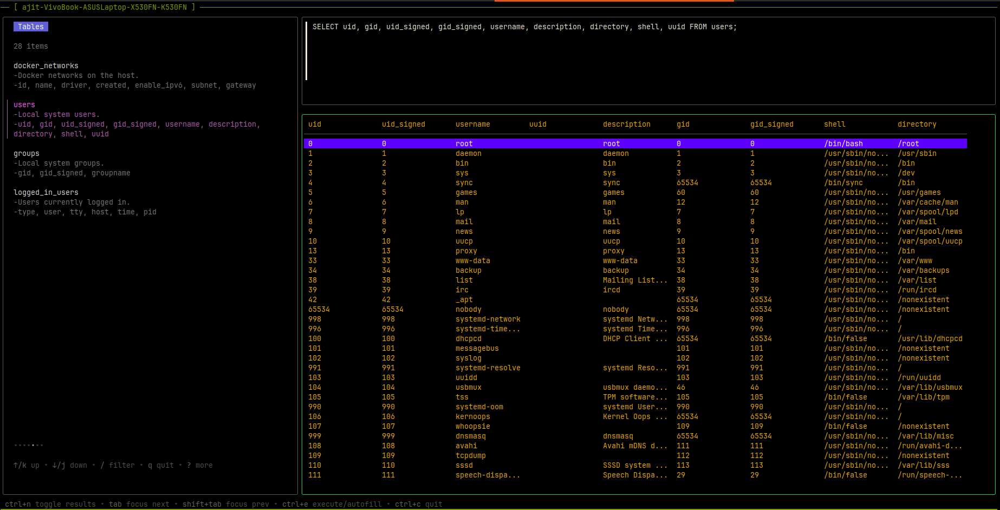
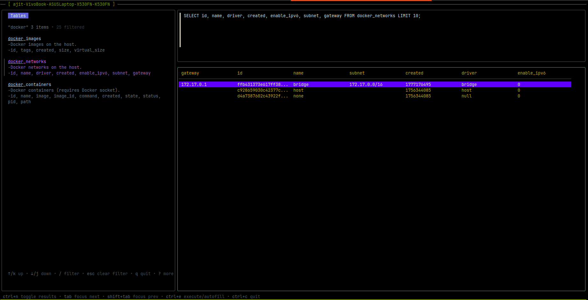
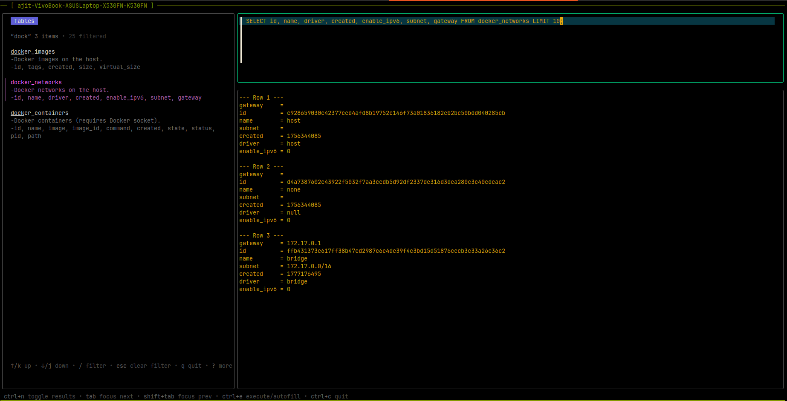
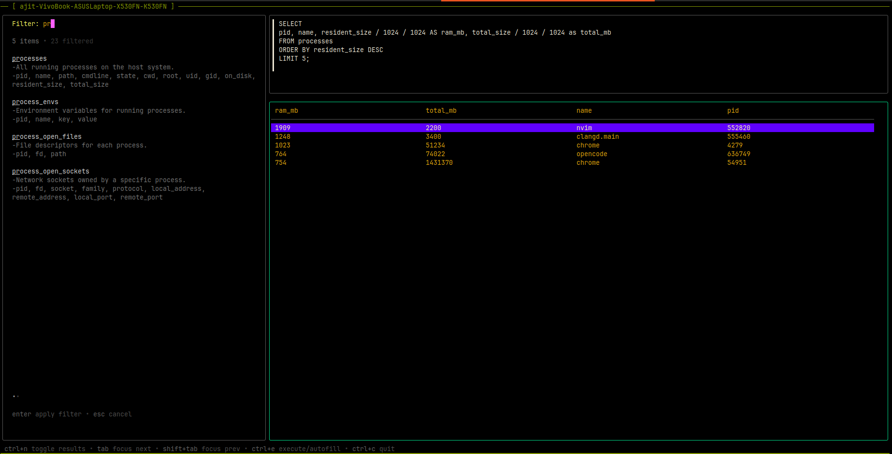
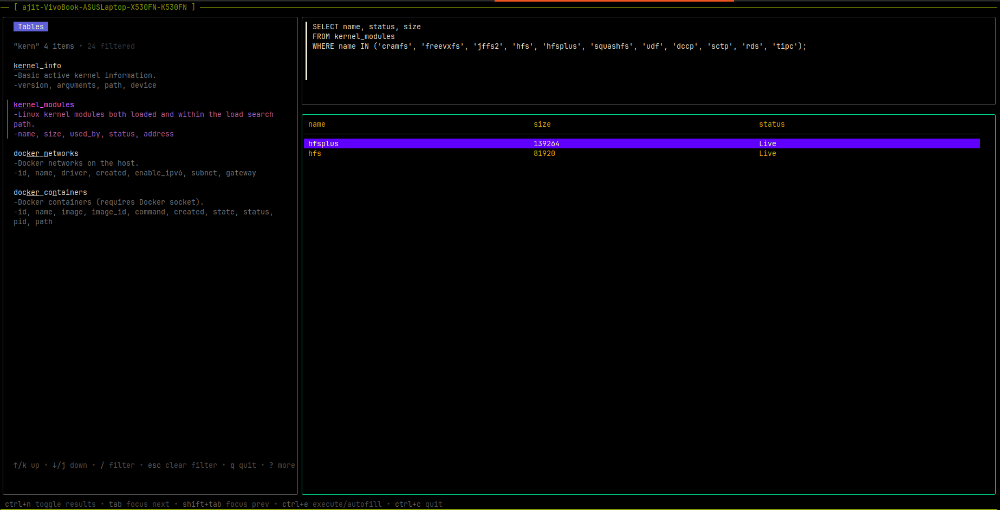
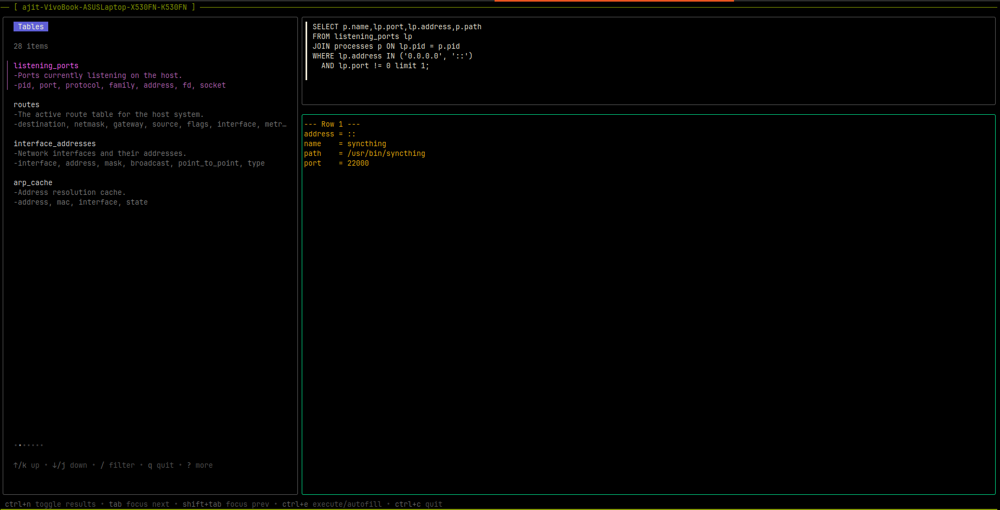
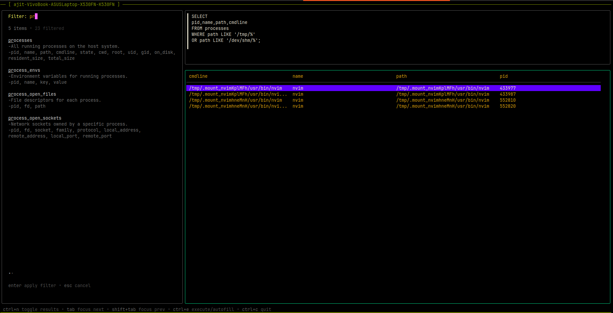
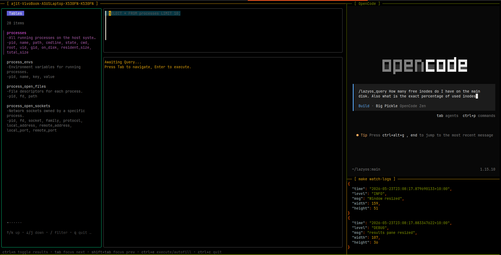
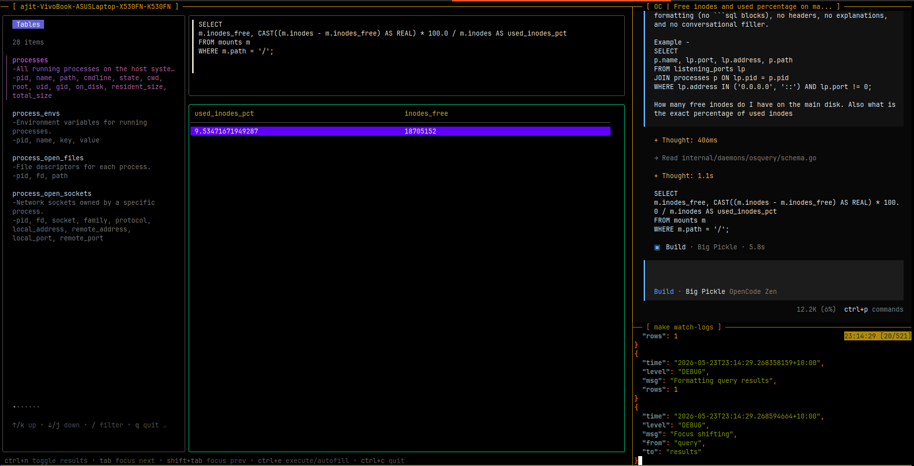

# LazyOS

Visualize, query, and audit your entire OS directly from the terminal.

LazyOS is a terminal-based interactive client designed to streamline host visibility and system auditing by bridging the gap between the analytical power of osquery and the ergonomics of a modern text user interface (TUI). Built using the Go Bubble Tea framework, it replaces complex schemas, verbose CLI flags, and manual jq filtering with an intuitive three-pane workspace featuring an active schema browser, a multi-line SQL editor, and a dynamic results inspector.


*The three-pane layout: sidebar (left) with discoverable tables, query bar (bottom-right), and results view (top-right).*

---

## Prerequisites

- [Go](https://go.dev/) 1.21 or later
- [osquery](https://github.com/osquery/osquery) — an active `osqueryd` daemon providing an extension socket (typically `/var/osquery/osquery.em` or `/tmp/osquery.em`).
- [Bubble Tea](https://github.com/charmbracelet/bubbletea) — the Go framework powering the TUI (fetched automatically via `go mod`).
- [`jq`](https://jqlang.github.io/jq/) — required by `make watch-logs` for pretty-printing JSON logs. (A common pattern in graphical applications to monitor background events and usage.)

---

## Documentation

For more detailed information about the system architecture and internal workings, see the [docs/](docs/) directory:

- [System Architecture](./docs/architecture.md) — design patterns, domain model, and component relationships.
- [Sequence Flows](./docs/sequence_flows.md) — internal TUI event sequence diagrams.
- [External Interaction (osquery & Thrift)](./docs/osquery_interaction.md) — how LazyOS communicates with the osquery daemon.
- [UI and Key Bindings](./docs/ui_and_keys.md) — layout, navigation, and key mapping.
- [Configuration](./docs/configuration.md) — config file format and available options.
- [Testing](./docs/testing.md) — test suite organization, mock architecture, and coverage.

---

## Workflows

### Browsing Schema

Navigate through all available osquery tables. LazyOS reads the exact schema from your active osquery instance and presents it in a scrollable sidebar.

Results can be viewed in two modes, toggled with `Ctrl+N`:

| Mode | Screenshot |
|---|---|
| **Table mode** — columns for structured scanning. Truncates when too many to fit the pane width. |  |
| **Line mode** — scrollable key-value pairs. Essential for wide schemas where table mode would omit data. |  |

### Querying Data

Enter raw SQL to fetch data from your local machine. The example below lists the most memory-intensive running processes, converting raw byte values into a human-readable format:


*Identifying the most memory-intensive processes with `resident_size` and `total_size` formatted as MB.*

### Compliance Checks

LazyOS can also be valuable as a continuous compliance verification tool. The queries below map directly to hardened security benchmarks (CIS, etc.) and can be executed on demand or integrated into audit workflows.

---

#### CIS Kernel Module Blacklist

CIS Benchmarks for Linux require disabling obsolete filesystem modules (`cramfs`, `freevxfs`, `jffs2`, `hfs`, `hfsplus`, `squashfs`, `udf`) and uncommon network protocols (`dccp`, `sctp`, `rds`, `tipc`) to reduce the kernel's attack surface. We can query `kernel_modules` to verify that none of these forbidden modules are loaded. If the query returns any rows, the host fails the check.


*Querying `kernel_modules` for blacklisted modules — rows present means non-compliance.*

---

#### Publicly Exposed Services

By joining `listening_ports` with `processes` on `pid`, we can identify every service listening on `0.0.0.0` or `::` (all interfaces) — meaning it is potentially reachable from the outside network. The result includes the process name, port, bound address, and binary path, making it easy to audit unintended exposure.


*Services listening on all interfaces — potential network exposure surface.*

---

#### Suspicious Process Execution

Replaces manual `/tmp` auditing. Processes running from world-writable directories (`/tmp`, `/dev/shm`) are a common indicator of malicious binaries or misconfigured scripts. LazyOS queries `processes` with a path filter to surface any process whose binary lives in these locations — no more grepping through `ps aux` output.


*Processes running from writable temporary directories — potential security concern.*

### AI-Assisted Query Generation

Not sure how to write the SQL for a compliance check or an ad-hoc investigation?
AI agents can integrate easily with LazyOS. I'm using  [opencode](https://opencode.ai) here.. Describe what you need in plain English, and the agent generates the osquery SQL on the spot.

The example below shows a natural-language request for inode usage:

| Step | Screenshot |
|---|---|
| Asking the agent about free inodes |  |
| Agent's generated SQL response |  |

This workflow keeps you in the terminal — no context-switching to a browser, no digging through osquery docs. Just describe the question and execute the result.

---

## Build and Execution

LazyOS provides a `Makefile` that covers building, running, testing, log-watching, and cleanup.

| Target | Purpose |
|---|---|
| `make run` | Interactive prompt for all config flags |
| `make run-with-defaults` | Run immediately with compiled-in defaults |
| `make watch-logs` | Tail and pretty-print the log file via `jq` |
| `make build` | Build a standalone `lazyos` binary |
| `make test` | Run all tests (summary) |
| `make test-force` | Run all tests, bypassing cache |
| `make test-coverage` | Run tests with per-package coverage report |
| `make test-coverage-html` | Generate and open HTML coverage report |
| `make clean` | Remove build artifacts and root `*.log` files |
| `make clean-default-logs` | Remove `~/.local/state/lazyos/lazyos.log` |

### Running

```bash
make run
```

Prompts for every option with defaults in brackets. Press `Enter` to accept:

```
Configuring LazyOS (press Enter to accept defaults)...

  Config File [~/.config/lazyos/config.yml]:
  OSQuery Socket Path [/tmp/osquery.em]:
  Startup Timeout [2s]:
  Query Timeout [10s]:
  Log File [~/.local/state/lazyos/lazyos.log]:
  Keep Log File? (true/false) [false]:

  Running: lazyos --osquery-socket=/tmp/osquery.em --osquery-startup-timeout=2s --osquery-query-timeout=10s --keep-log=false
```

```bash
make run-with-defaults
```

Skips prompts entirely:

```
Running LazyOS with default configuration...
```

```bash
make build
```

Produces a `lazyos` binary in the project root. Run it manually:

```bash
./lazyos --osquery-socket /var/osquery/osquery.em --osquery-startup-timeout 5s --osquery-query-timeout 30s
```

### Watching Logs

```bash
make watch-logs
```

Prompts for a log path (default `~/.local/state/lazyos/lazyos.log`). Press `Enter` to accept and begin tailing through `jq`:

```
Configuring LazyOS (press Enter to accept defaults)...

  NOTE: This path must match --log-file used in 'make run'.

  Log File [~/.local/state/lazyos/lazyos.log]:

Watching /home/user/.local/state/lazyos/lazyos.log — press Ctrl+C to stop.
```

Each JSON log line from the app is pretty-printed by `jq` in real time. Press `Ctrl+C` to stop — prints `Log viewer closed.` cleanly.

### Running Tests

```bash
make test
```

```
Running tests...
∅  cmd/lazyos
∅  internal/config
∅  internal/daemons/mock
∅  internal/daemons/osquery
✓  internal/daemons (cached)
✓  internal/logger (4ms)
✓  internal/tui/views/querybar (cached)
✓  internal/tui/views/sidebar (cached)
✓  internal/tui/views/results (cached)
✓  internal/tui (21ms)

DONE 107 tests in 0.196s
```

```bash
make test-force
```

Same output, but bypasses Go's test cache (`-count=1`).

```bash
make test-coverage
```

```
Running tests with coverage...

  Included (unit tests exist):
    - internal/daemons        (coverage: 100.0%)
    - internal/logger         (fast, isolated integration — t.TempDir() / t.Setenv())
    - internal/tui            (coverage: 100.0%)
    - internal/tui/views/querybar (coverage: 100.0%)
    - internal/tui/views/results  (coverage: 100.0%)
    - internal/tui/views/sidebar  (coverage: 100.0%)

  Omitted (no unit tests):
    - cmd/lazyos              (entry point, no logic to test)
    - internal/config         (types-only package, no logic)
    - internal/daemons/mock   (test helpers consumed by other tests)
    - internal/daemons/osquery    (requires live osquery socket; integration test candidate)

✓  internal/daemons (cached) (coverage: 100.0% of statements)
✓  internal/logger (cached) (coverage: 100.0% of statements)
✓  internal/tui/views/querybar (cached) (coverage: 100.0% of statements)
✓  internal/tui/views/sidebar (cached) (coverage: 100.0% of statements)
✓  internal/tui/views/results (cached) (coverage: 100.0% of statements)
✓  internal/tui (cached) (coverage: 100.0% of statements)

DONE 107 tests in 0.007s
```

```bash
make test-coverage-html
```

Same output as `test-coverage`, then opens the HTML coverage report in your browser.

### Cleaning Up

```bash
make clean
```

Removes the `lazyos` binary from the project root.

```bash
make clean-default-logs
```

Removes `~/.local/state/lazyos/lazyos.log` if it exists:

```
Removed ~/.local/state/lazyos/lazyos.log
```

If no log file exists:

```
No log file found at ~/.local/state/lazyos/lazyos.log
```
