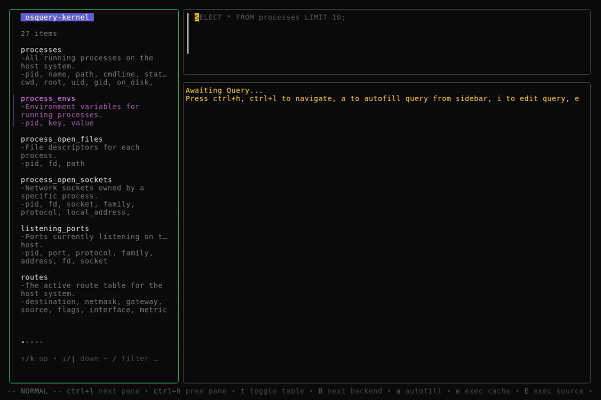
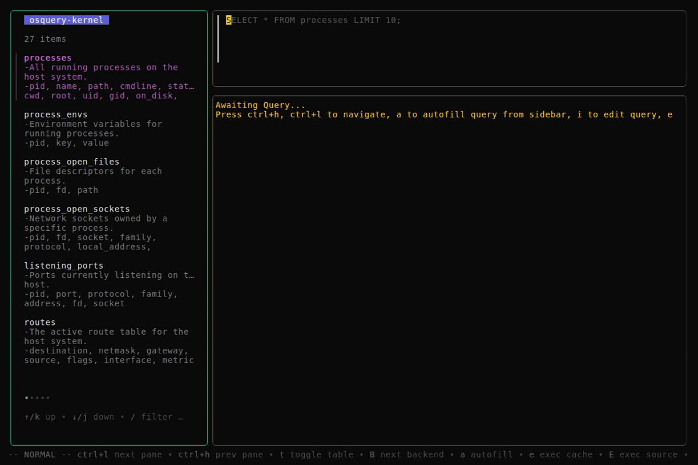

# LazyOS

Visualize, query, and audit your entire operating system and cloud infrastructure directly from the terminal.

LazyOS is a terminal-based interactive client that bridges the analytical power of osquery with a modern Text User Interface (TUI). Built with the Go Bubble Tea framework, it replaces complex schemas, verbose CLI flags, and manual filtering with an intuitive three-pane workspace: a discoverable table browser, a multi-line SQL editor, and a dynamic results inspector. Query kernel tables (processes, users, network), cloud resources (EC2, S3, IAM), or both simultaneously — with results cached in an embedded SQLite store for instant re-querying.

### Kernel Tables


*Browse kernel tables (processes, users), execute queries with automatic SQLite caching, toggle between line and table modes, and edit SQL in INSERT mode — all with vim-style modal keybindings.*

### Cloud Infrastructure (AWS)


*Cycle to the AWS backend with `B`, search for tables by name, autofill `SELECT` queries, and inspect cloud resources with the same TUI — EC2, S3, IAM, RDS, ECS, EKS, and more.*

---

## Prerequisites

- [Go](https://go.dev/) 1.21 or later
- [osquery](https://github.com/osquery/osquery) — an active `osqueryd` daemon providing an extension socket (typically `/var/osquery/osquery.em` or `/tmp/osquery.em`).
- [Bubble Tea](https://github.com/charmbracelet/bubbletea) — the Go framework powering the TUI (fetched automatically via `go mod`).
- [`jq`](https://jqlang.github.io/jq/) — required by `make watch-logs` for pretty-printing JSON logs. (A common pattern in graphical applications to monitor background events and usage.)

---

## Documentation

For more detailed information about the system architecture and internal workings, see the [docs/](docs/) directory:

- [System Architecture](./docs/architecture.md) — design patterns, domain model, and component relationships.
- [Sequence Flows](./docs/sequence_flows.md) — internal TUI event sequence diagrams.
- [External Interaction (osquery & Thrift)](./docs/osquery_interaction.md) — how LazyOS communicates with the osquery daemon.
- [UI and Key Bindings](./docs/ui_and_keys.md) — layout, navigation, and key mapping.
- [Configuration](./docs/configuration.md) — config file format and available options.
- [Unit Tests](./docs/unit_tests.md) — test suite organization, mock architecture, and coverage.
- [Integration Tests](./docs/osquery_integration_test.md) — osquery client integration test suite against a live daemon.
- [Diagnostic Queries](./docs/diagnostic_queries.md) — use-case-driven query workflows for system observability (virtual memory, and more).
- [Remote Deployment](./docs/remote_deployment.md) — deploy osqueryd on a remote node and connect LazyOS via SSH socket forwarding, with optional EC2 provisioning via OpenTofu.

---

## Workflows

### Browsing Schema

Navigate through all available osquery tables. LazyOS reads the exact schema from your active osquery instance and presents it in a scrollable sidebar.

Results can be viewed in two modes, toggled with `Ctrl+N`:

| Mode | Screenshot |
|---|---|
| **Table mode** — columns for structured scanning. Truncates when too many to fit the pane width. |  |
| **Line mode** — scrollable key-value pairs. Essential for wide schemas where table mode would omit data. |  |

### Querying Data

Enter raw SQL to fetch data from your local machine. The example below lists the most memory-intensive running processes, converting raw byte values into a human-readable format:


*Identifying the most memory-intensive processes with `resident_size` and `total_size` formatted as MB.*

### Compliance Checks

LazyOS can also be valuable as a continuous compliance verification tool. The queries below map directly to hardened security benchmarks (CIS, etc.) and can be executed on demand or integrated into audit workflows.

---

#### CIS Kernel Module Blacklist

CIS Benchmarks for Linux require disabling obsolete filesystem modules (`cramfs`, `freevxfs`, `jffs2`, `hfs`, `hfsplus`, `squashfs`, `udf`) and uncommon network protocols (`dccp`, `sctp`, `rds`, `tipc`) to reduce the kernel's attack surface. We can query `kernel_modules` to verify that none of these forbidden modules are loaded. If the query returns any rows, the host fails the check.


*Querying `kernel_modules` for blacklisted modules — rows present means non-compliance.*

---

#### Publicly Exposed Services

By joining `listening_ports` with `processes` on `pid`, we can identify every service listening on `0.0.0.0` or `::` (all interfaces) — meaning it is potentially reachable from the outside network. The result includes the process name, port, bound address, and binary path, making it easy to audit unintended exposure.


*Services listening on all interfaces — potential network exposure surface.*

---

#### Suspicious Process Execution

Replaces manual `/tmp` auditing. Processes running from world-writable directories (`/tmp`, `/dev/shm`) are a common indicator of malicious binaries or misconfigured scripts. LazyOS queries `processes` with a path filter to surface any process whose binary lives in these locations — no more grepping through `ps aux` output.


*Processes running from writable temporary directories — potential security concern.*

### AI-Assisted Query Generation

Not sure how to write the SQL for a compliance check or an ad-hoc investigation?
AI agents can integrate easily with LazyOS. I'm using  [opencode](https://opencode.ai) here.. Describe what you need in plain English, and the agent generates the osquery SQL on the spot.

The example below shows a natural-language request for inode usage:

| Step | Screenshot |
|---|---|
| Asking the agent about free inodes |  |
| Agent's generated SQL response |  |

This workflow keeps you in the terminal — no context-switching to a browser, no digging through osquery docs. Just describe the question and execute the result.

---

## Quick Start

> **Requires Go 1.21+** — the script below builds the LazyOS binary from source via `go install`.

```bash
curl -sL https://raw.githubusercontent.com/ajitm722/LazyOS/main/lazyos-osquery.sh | bash
```

Downloads everything into `/tmp` — osqueryd, the LazyOS binary, and the sandbox wrapper — and opens the TUI. When you quit, every file and process is wiped. No clone, no install, no traces.

For a persistent setup with caching:

```bash
git clone https://github.com/ajitm722/LazyOS.git
cd LazyOS
make run-sandbox
```

---

## Build and Execution

LazyOS provides a `Makefile` that covers building, running, testing, log-watching, and cleanup.

| Target | Purpose |
|---|---|
| `make run-sandbox` | **Primary entry point.** Downloads osqueryd, builds binary, and runs inside kernel sandbox |
| `make run-sandbox-all` | Run sandbox with **both** kernel and AWS cloud backends enabled |
| `./lazyos-osquery.sh` | Ephemeral evaluation mode — downloads everything to `/tmp`, runs, and wipes all traces on exit |
| `make run` | Interactive prompt for all config flags (requires an existing osquery daemon) |
| `make run-with-defaults` | Run immediately with compiled-in defaults (requires an existing osquery daemon) |
| `make watch-logs` | Tail and pretty-print the log file via `jq` |
| `make build` | Build a standalone `lazyos` binary |
| `make test` | Run all tests (summary) |
| `make test-force` | Run all tests, bypassing cache |
| `make test-coverage` | Run tests with per-package coverage report |
| `make test-coverage-html` | Generate and open HTML coverage report |
| `make test-integration` | Run integration tests (summary) against live osquery daemon |
| `make test-integration-verbose` | Run integration tests with verbose output |
| `make clean` | Remove the `lazyos` binary and the entire `./build/` directory (osqueryd is re-downloaded on next `make run-sandbox`) |
| `make clean-default-logs` | Remove `~/.local/state/lazyos/lazyos.log` |

### Running with Sandbox (Primary)

```bash
make run-sandbox
```

Downloads an isolated osqueryd (if not already cached in `./build/osquery/`), builds the `lazyos` binary, starts an ephemeral daemon, and launches the TUI with kernel tables — all in one command. The daemon is automatically cleaned up when the application exits.

To include AWS cloud infrastructure tables alongside kernel tables:

```bash
make run-sandbox-all
```

This enables both the `kernel` and `aws` backends, exposing EC2, S3, IAM, RDS, ECS, EKS, and other cloud resource tables via the sidebar. Use `B` to cycle between backends.

> **AWS requires cloudquery** — the AWS tables are provided by the [cloudquery](https://github.com/ajitm722/cloudquery) osquery extension. See the [cloudquery configuration guide](./docs/osquery_interaction.md#cloudquery-cloud-resource-instrumentation) for setup instructions, including AWS credentials, extension registration, and supported tables.

First run:

```
LazyOS requires a local osquery daemon to run the sandbox.
Do you want to download osquery into ./build/osquery? (y/N): y
Downloading osquery-5.11.0...
Locating and moving osqueryd binary...
Download complete.
Building lazyos...
Launching LazyOS in sandbox...
Starting ephemeral osqueryd...
Socket ready.
```

Subsequent runs (osqueryd already cached):

```
Sandbox dependency (osqueryd) already exists. Skipping download.
Building lazyos...
Launching LazyOS in sandbox...
Starting ephemeral osqueryd...
Socket ready.
```

### Ephemeral Evaluation Mode

```bash
./lazyos-osquery.sh
```

Downloads osqueryd, builds the binary, and copies the daemon wrapper — all into a temporary directory under `/tmp`. Everything is wiped on exit. No files or processes are left behind.

```
======================================================
 LazyOS (Ephemeral Evaluation Mode)
======================================================
This script will download everything into memory/tmp.
When you close the app, NO binaries, NO daemons, and
NO logs will be left on your machine.
======================================================
[*] Fetching osquery (5.11.0)...
[*] Fetching LazyOS binary...
[*] Fetching Daemon Wrapper...
[*] Ephemeral Sandbox Active: Zero bloat...
[*] Sandbox completely wiped. Goodbye!
```

> **Note:** Unlike `make run-sandbox`, this does **not** cache `./build/`. Every run is a fresh ephemeral session.
>
> **Note:** `lazyos-osquery.sh` currently works **only on Linux**. The download URL and binary extraction paths are Linux-specific.

> **Note:** `make clean` removes `./build/`, so the next `make run-sandbox` will prompt to re-download osqueryd.

### Running with Existing Daemon

```bash
make run
```

Prompts for every option with defaults in brackets. Press `Enter` to accept:

```
Configuring LazyOS (press Enter to accept defaults)...

  Config File [~/.config/lazyos/config.yml]:
  OSQuery Socket Path [/tmp/osquery.em]:
  Startup Timeout [10s]:
  Query Timeout [100s]:
  Backends (comma-separated) [kernel]:
  Log File [~/.local/state/lazyos/lazyos.log]:
  Keep Log File? (true/false) [false]:

  Running: lazyos --osquery-socket=/tmp/osquery.em --osquery-startup-timeout=10s --osquery-query-timeout=100s --backend kernel --keep-log=false
```

```bash
make run-with-defaults
```

Skips prompts entirely:

```
Running LazyOS with default configuration...
```

```bash
make build
```

Produces a `lazyos` binary in the project root. Run it manually:

```bash
./lazyos --osquery-socket /var/osquery/osquery.em --osquery-startup-timeout 5s --osquery-query-timeout 30s --backend kernel
```

### Watching Logs

```bash
make watch-logs
```

Prompts for a log path (default `~/.local/state/lazyos/lazyos.log`). Press `Enter` to accept and begin tailing through `jq`:

```
Configuring LazyOS (press Enter to accept defaults)...

  NOTE: This path must match --log-file used in 'make run'.

  Log File [~/.local/state/lazyos/lazyos.log]:

Watching /home/user/.local/state/lazyos/lazyos.log — press Ctrl+C to stop.
```

Each JSON log line from the app is pretty-printed by `jq` in real time. Press `Ctrl+C` to stop — prints `Log viewer closed.` cleanly.

### Running Tests

```bash
make test
```

```
Running tests...
✓  internal/cache
✓  internal/daemons
✓  internal/logger
✓  internal/tui
✓  internal/tui/views/querybar
✓  internal/tui/views/results
✓  internal/tui/views/sidebar

DONE 116 tests in 0.375s
```

```bash
make test-force
```

Same output, but bypasses Go's test cache (`-count=1`).

```bash
make test-coverage
```

```
Running tests with coverage...

  Included (unit tests exist):
    - internal/cache           (coverage: 98.9%)
    - internal/daemons         (coverage: 100.0%)
    - internal/logger          (fast, isolated integration)
    - internal/tui             (coverage: 97.2%)
    - internal/tui/views/querybar  (coverage: 100.0%)
    - internal/tui/views/results   (coverage: 100.0%)
    - internal/tui/views/sidebar   (coverage: 100.0%)

  Omitted (no unit tests):
    - cmd/lazyos              (entry point, no logic to test)
    - internal/config         (types-only, no logic)
    - internal/daemons/mock   (test helpers)
    - internal/daemons/osqueryd   (requires live osquery socket)
    - internal/store/sqlite   (requires -tags=integration)

✓  internal/cache           (coverage: 98.9%)
✓  internal/daemons         (coverage: 100.0%)
✓  internal/logger          (coverage: 100.0%)
✓  internal/tui/views/querybar  (coverage: 100.0%)
✓  internal/tui/views/sidebar   (coverage: 100.0%)
✓  internal/tui/views/results   (coverage: 100.0%)
✓  internal/tui             (coverage: 97.2%)

DONE 116 tests in 0.375s
```

```bash
make test-coverage-html
```

Same output as `test-coverage`, then opens the HTML coverage report in your browser.

### Running Integration Tests

```bash
make test-integration
```

```
Running integration tests...
✓  internal/daemons/osqueryd (2.358s)

DONE 93 tests in 2.358s
Cleaning up sandbox...
The osquery daemon has been shut down, but the build is cached in ./build/ for faster next runs. Run 'make clean' to remove it.
```

### Cleaning Up

```bash
make clean
```

Removes the `lazyos` binary and the entire `./build/` directory (including the cached osqueryd):

```
Cleaning up build artifacts...
Removed ./build directory.
```

The next `make run-sandbox` will prompt to re-download osqueryd.

```bash
make clean-default-logs
```

Removes `~/.local/state/lazyos/lazyos.log` if it exists:

```
Removed ~/.local/state/lazyos/lazyos.log
```

If no log file exists:

```
No log file found at ~/.local/state/lazyos/lazyos.log
```
