# LazyOS Architecture Documentation

## Domain Model

This class diagram illustrates the architectural boundaries and composition within the application.

```mermaid
classDiagram
    %% Core TUI Application
    class AppModel {
        +layout Layout
        +input InputHandler
        +panes PaneManager
        +clients map[string]Queryer
        +backendOrder []string
        +activeIndex int
        +activeBackend string
        +Init() tea.Cmd
        +Update(msg tea.Msg) (tea.Model, tea.Cmd)
        +View() string
    }

    class Layout {
        <<struct>>
        +Sidebar sidebar.Model
        +Querybar querybar.Model
        +Results results.Model
        +Help help.Model
        -termWidth int
        -termHeight int
        -tooSmall bool
        +Init() tea.Cmd
        +Update(msg tea.WindowSizeMsg) (Layout, tea.Cmd)
        +View(activeFocus PaneID, keys help.KeyMap, mode Mode) string
    }

    class InputHandler {
        <<struct>>
        +Actions []BoundAction
        +ShortHelp() []key.Binding
        +FullHelp() [][]key.Binding
    }

    class PaneManager {
        <<struct>>
        +Order []PaneID
        +Index int
        +Next() PaneManager
        +Prev() PaneManager
        +Current() PaneID
        +Set(id PaneID) PaneManager
    }

    class PaneID {
        <<type string>>
    }

    %% Command Pattern / Actions
    class AppAction {
        <<interface>>
        +Apply(m AppModel) (AppModel, tea.Cmd)
    }

    class QuitAction { +Apply(m AppModel) (AppModel, tea.Cmd) }
    class ToggleTableAction { +Apply(m AppModel) (AppModel, tea.Cmd) }
    class FocusNextAction { +Apply(m AppModel) (AppModel, tea.Cmd) }
    class FocusPrevAction { +Apply(m AppModel) (AppModel, tea.Cmd) }
    class NextBackendAction { +Apply(m AppModel) (AppModel, tea.Cmd) }
    class AutofillAction { +Apply(m AppModel) (AppModel, tea.Cmd) }
    class ExecuteAction { +Apply(m AppModel) (AppModel, tea.Cmd) }
    class ExecuteSourceAction { +Apply(m AppModel) (AppModel, tea.Cmd) }

    class BoundAction {
        <<struct>>
        +Binding key.Binding
        +Action AppAction
        +ShowInShortHelp bool
    }

    %% Backend Abstraction Layer
    class Queryer {
        <<interface>>
        +Query(ctx context.Context, sql string) (rows []map[string]string, columns []string, err error)
        +Close() error
        +GetSchema() []TableSchema
    }

    class TableSchema {
        <<struct>>
        +Name string
        +Description string
        +Columns string
    }

    class CachedQueryer {
        -upstream daemons.Queryer
        -store *sqlite.SQLiteStore
        +Query(ctx, sql) (rows, cols, err)
        +QuerySource(ctx, sql) (rows, cols, err)
        +Close() error
        +GetSchema() []TableSchema
    }

    class SQLiteStore {
        +Query(ctx, sql) (rows, cols, err)
        +SyncTable(name, columns, rows) error
        +HasTable(name) bool
        +Health(ctx) error
        +Close() error
    }

    class OsqueryClient {
        +Query(ctx, sql) (rows, cols, err)
        +Close() error
    }

    class KernelQueryer { +Query(ctx, sql) (rows, cols, err) +Close() error +GetSchema() []TableSchema }
    class AWSQueryer { +Query(ctx, sql) (rows, cols, err) +Close() error +GetSchema() []TableSchema }

    class KernelTables { <<catalog>> +KernelTables []TableSchema }
    class AWSTables { <<catalog>> +AWSTables []TableSchema }

    note for Queryer "sentinel errors: ErrQueryTimeout, ErrQueryFailed"
    note for CachedQueryer "e → Query (store-backed), E → QuerySource (upstream + sync)"

    %% Relationships
    AppModel *-- Layout
    AppModel *-- InputHandler
    InputHandler *-- BoundAction
    BoundAction --> AppAction
    AppModel *-- PaneManager
    PaneManager --> PaneID
    AppModel --> "clients map" Queryer
    AppAction <|.. QuitAction
    AppAction <|.. ToggleTableAction
    AppAction <|.. FocusNextAction
    AppAction <|.. FocusPrevAction
    AppAction <|.. NextBackendAction
    AppAction <|.. AutofillAction
    AppAction <|.. ExecuteAction
    AppAction <|.. ExecuteSourceAction

    CachedQueryer --> Queryer : wraps (upstream)
    CachedQueryer --> SQLiteStore : persists directly
    Queryer <|.. KernelQueryer : implements
    Queryer <|.. AWSQueryer : implements
    Queryer <|.. CachedQueryer : implements (decorator)
    KernelQueryer --> OsqueryClient : embeds
    AWSQueryer --> OsqueryClient : embeds
    KernelQueryer --> KernelTables : GetSchema returns
    AWSQueryer --> AWSTables : GetSchema returns
    Queryer *-- TableSchema
```

## High-Level System Architecture

LazyOS serves as a bridge between a terminal user and the host operating system. The architecture is divided into a frontend interface (the TUI), a caching layer, and a set of backend data source connectors. Multiple backends may be active simultaneously (e.g., kernel and AWS tables, both served by the same osquery daemon), each implementing the `Queryer` interface defined in `internal/daemons/`.

The application employs strict unidirectional data flow. The TUI never communicates directly with backends — all queries pass through the `CachedQueryer` decorator, which routes them to either the local SQLite store or the upstream data source depending on the user's intent. This keeps the UI responsive while isolating it from backend latency.

Backend instantiation is wired in `cmd/lazyos/root.go` via the `bootstrapBackends` function, which maintains a typed registry of backend initializers (`backendInit{key, fn}`). The `--backend` flag (repeatable, default `kernel`) controls which backends are registered. Adding a new backend requires one entry in the `available` slice and a new sub-package under `internal/daemons/osqueryd/`.

Backend cycling is handled by `NextBackendAction` (bound to `B` by default, overridable via `next_backend` in config). It cycles through the ordered `backendOrder` slice, swaps sidebar schema, and fires a resize event.

## Caching Architecture

LazyOS embeds a SQLite database as a local persistent cache. Every table queried through the `e` (execute cached) path is lazy-loaded on first access: the backend is queried for the full table (`SELECT *`), the result is written to SQLite, and the user's original SQL executes against the local store. Subsequent queries against the same table hit the local store directly and return instantly — no backend call occurs.

The `E` (execute source) path always queries the upstream backend directly and refreshes the cached copy of every referenced table, ensuring authoritative data while keeping the cache up to date.

The `CachedQueryer` struct in `internal/cache/` implements the `daemons.Queryer` interface and acts as a decorator around the upstream backend. It holds a direct reference to `*sqlite.SQLiteStore` for both persistence and local query execution. The store has no abstract interface wrapper — it is called directly, and the architecture only adds an abstraction boundary when a second store implementation is needed.

## System Components

| Component | Description |
|---|---|
| **User** | The operator interacting with the application via terminal keystrokes to navigate, construct queries, and review data. |
| **LazyOS TUI** | The primary application implemented in Go. Uses the Bubble Tea framework to render an interactive three-pane layout. Manages user state, input routing, and communicates with the caching layer. |
| **CachedQueryer** | A `Queryer` decorator that intercepts all query calls. `e` (cached) executes against the local store, lazy-loading missing tables from the upstream backend. `E` (source) fetches from the upstream and refreshes the store. |
| **SQLite Store** | An embedded persistent cache at `~/.cache/lazyos/lazyos.db`. Stores full table snapshots as SQL tables. All values stored as `TEXT`. WAL journal mode is enabled for concurrent read/write performance. |
| **osquery Daemon** | An external background service exposing operating system metrics (processes, network, users) as SQL tables. When extended with the cloudquery extension, additionally exposes cloud resource tables. LazyOS communicates with it via Thrift RPC over a Unix domain socket. |

## Internal Package Structure

The project follows standard Go layout conventions with strict separation of concerns.

* `cmd/lazyos/`: The execution entry point. Uses Cobra for CLI and Viper for config. `runApp()` manages the full lifecycle: logger initialization, backend bootstrap, opening the SQLite store, wrapping each backend in a `CachedQueryer`, and launching the TUI. No sync or prefetch commands exist — the cache is lazily populated on first query.

* `internal/config/`: Configuration types serialized from YAML or CLI flags. Contains `Config`, `Keys` (with `execute_source` for the `E` key binding), and `CacheDBPath` for the SQLite database path override.

* `internal/cache/`: Implements the lazy-loading query cache.
  * `queryer.go`: Defines the `CachedQueryer` struct, its constructor, and the core `Query`, `QuerySource`, `fetchTable`, `Close`, and `GetSchema` methods. This file contains only the decorator logic — SQL parsing lives in the separate `sql_parser.go`.
  * `sql_parser.go`: Contains all SQL text-parsing utilities: `extractTableNames` (extracts table names from `FROM`/`JOIN` clauses), `parseFromClause`, `isJoinWord`, `isQueryKeyword`, `isWordChar`, and `keywordNormalize`. These helpers have no dependencies on the cache or store types.

* `internal/store/sqlite/`: Concrete SQLite implementation of the cache backend. Uses `mattn/go-sqlite3` (CGo driver) with WAL journal mode and a 5-second busy timeout. Exports `SQLiteStore` with methods `Query`, `SyncTable`, `HasTable`, `Health`, and `Close`. `SyncTable` atomically replaces a table's full contents in a single transaction. Tests require the `integration` build tag (`go test -tags=integration`).

* `internal/tui/`: The core Bubble Tea application.
  * `app.go`: Owns `AppModel` — the single source of truth for TUI state. Routes `RunQueryMsg` (cached) and `RunSourceQueryMsg` (source refresh) to the appropriate path. Type-asserts the active client to `*cache.CachedQueryer` to call `QuerySource` when the user presses `E`.
  * `actions.go`: Defines all `AppAction` implementations. `ExecuteAction` emits `RunQueryMsg` for the cached path. `ExecuteSourceAction` emits `RunSourceQueryMsg` for the source-refresh path.
  * `registry.go`: Maps key bindings to actions. `e` → `ExecuteAction`, `E` → `ExecuteSourceAction`.
  * `layout.go`: Owns `Layout`, lipgloss rendering, pane dimension math, and the terminal-too-small guard.
  * `views/`: Isolated UI components (sidebar, querybar, results).

* `internal/daemons/`: Defines the `Queryer` interface, `TableSchema` domain model, and sentinel errors (`ErrQueryTimeout`, `ErrQueryFailed`). Contains `columns.go` with three helpers: `ExtractColumnNames` (parses `"pid, name"` into `["pid", "name"]`), `DeriveColumnsFromSchema` (extracts column names from the schema for a given SQL `FROM` table), and `AutofillColumns` (returns a comma-separated column string or `"*"` for sidebar autofill). This package acts purely as the domain contract — no backend or cache implementations live here.

* `internal/daemons/mock/`: Provides `MockQueryer` — a fully instrumented `Queryer` stub for tests. Supports simulated slow queries, configurable error injection, and custom result sets per SQL string.

* `internal/daemons/osqueryd/`: Low-level Thrift RPC communication with the osquery daemon. The `Client` struct wraps `goosquery.ExtensionManagerClient` and exposes `queryTimeout`-bounded `Query` calls. The `executeThriftQuery` method uses `QueryRowsContext` instead of `Query`, passing the deadline-bearing context through to the osquery-go locker. This prevents the locker from falling back to its very short internal default timeout when multiple goroutines contend for the shared Unix socket.
  * `internal/daemons/osqueryd/kernel/`: Contains `KernelTables` (27 kernel/system observability tables) and a `Queryer` struct embedding `*osqueryd.Client`, with `GetSchema()` returning `KernelTables`. Registered as `"kernel"`.
  * `internal/daemons/osqueryd/aws/`: Contains `AWSTables` (20 critical AWS resource tables) and a `Queryer` struct embedding `*osqueryd.Client`, with `GetSchema()` returning `AWSTables`. Registered as `"aws"`.

* `internal/logger/`: Structured JSON logging via `slog`. Writes to an XDG-compliant log file.

## Architectural Principles

### Lazy-Loading over Prefetching

The cache is populated on demand rather than through a separate sync phase. This eliminates startup delay, removes the need for a separate sync binary or Makefile target, and ensures the TUI is always immediately responsive. The cost is that the first query against any uncached table hits the upstream backend — subsequent queries are instant.

### Composition over Inheritance

`CachedQueryer` implements `daemons.Queryer` and embeds both an upstream `Queryer` and a `*sqlite.SQLiteStore`. It is itself a valid `Queryer` that can be passed directly to the TUI — no changes to the TUI's interface contract were needed. The decorator pattern allows the caching layer to be transparently inserted between the application and its backends.

### Single Shared Socket

All queries against a single backend share one Thrift socket connection. The osquery-go library serializes access through an internal locker, so spawning additional connections does not improve parallelism. Accordingly, lazy-loading and source-refresh logic use a single upstream client per backend rather than a connection pool. The locker's `MaxWaitTime` is set to match the configured query timeout, not the library's default.

### Concrete Store over Abstract Interface

The cache backend is `*sqlite.SQLiteStore` directly — no interface layer. This avoids premature abstraction and keeps the code straightforward. A store abstraction should be introduced only when a second implementation (e.g., Postgres, DuckDB) is required, at which point the desired interface can be extracted from the concrete usage patterns.

### Two Query Modes

The `e` and `E` keys map to two semantically distinct operations:
* **`e` (cached)**: Optimistic — returns what is in the local cache, lazily loading missing tables from the upstream. Fastest path after the first access.
* **`E` (source)**: Authoritative — fetches fresh data from the upstream backend and updates the cache, then runs the query against the refreshed local store.
