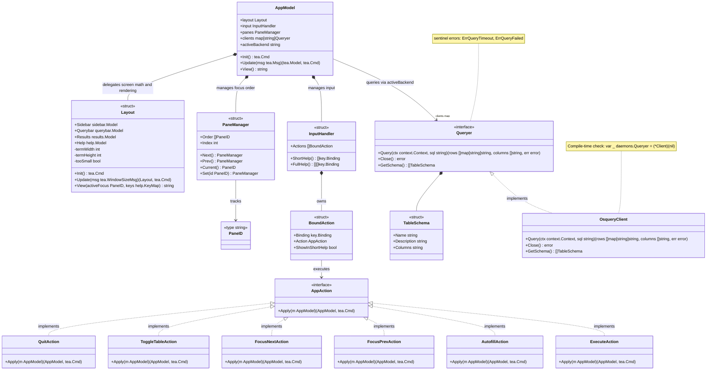
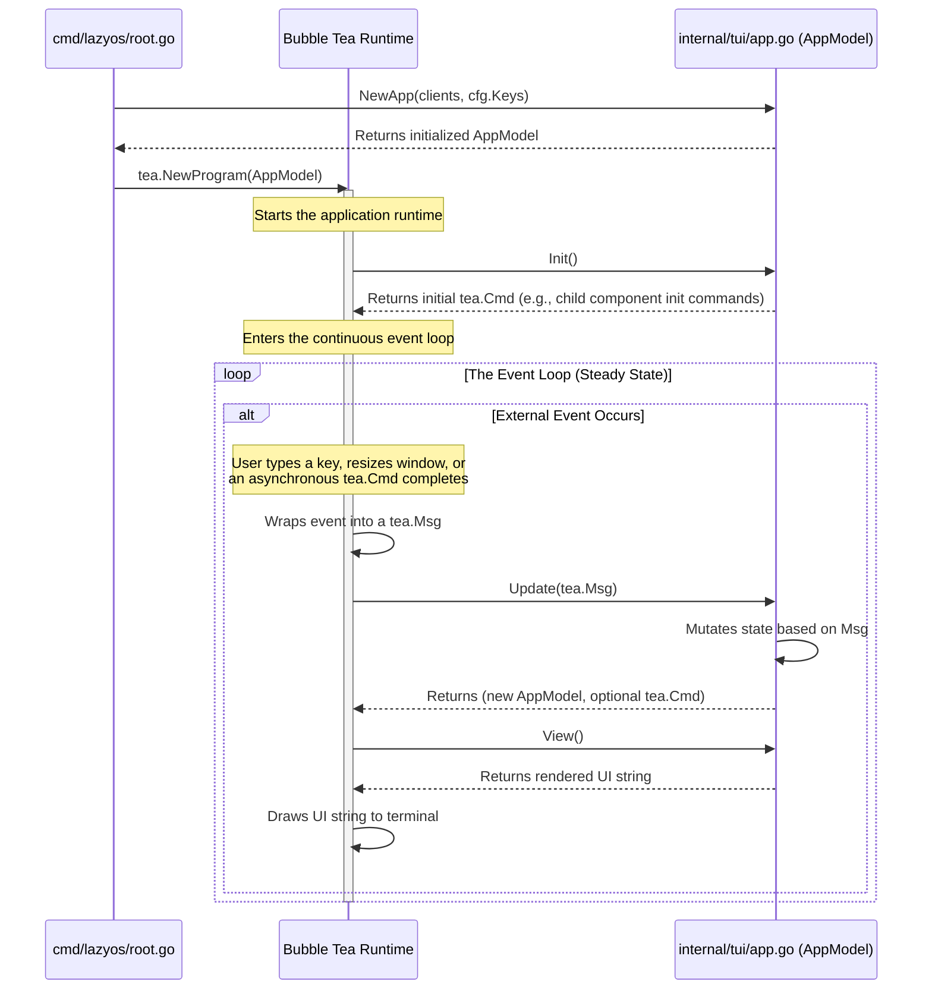

# LazyOS Architecture Documentation

## Domain Model

This class diagram illustrates the architectural boundaries and composition within the `internal/tui` package, the core of LazyOS.

## High-Level System Architecture

LazyOS serves as a structural bridge between a terminal user and the host operating system. The architecture is broadly divided into a frontend interface (the TUI) and a set of backend daemon connectors. Multiple backends may be active simultaneously (e.g., osquery alongside a future kubequery), each implementing the `Queryer` interface defined in `internal/daemons/`. The application employs a strict unidirectional data flow and modular composition to ensure the UI remains responsive while handling external database interactions. Backend instantiation is explicitly wired in `cmd/lazyos/root.go` via the `bootstrapDaemons` function, which maintains an explicit slice of initializer functions — keeping the CLI bootstrap and TUI code fully decoupled from any concrete daemon implementation.

## System Components

| Component | Description |
|---|---|
| **User** | The operator interacting with the application via terminal keystrokes to navigate, construct queries, and review data. |
| **LazyOS TUI** | The primary application implemented in Go. It utilizes the Bubble Tea framework to render an interactive three-pane layout. It manages user state, handles input routing, and communicates with the backend daemon. |
| **osquery Daemon** | An external background service that exposes operating system metrics (processes, network connections, users) as SQL tables. LazyOS requires this service to be active prior to execution. |
| **Unix Socket** | The inter-process communication (IPC) mechanism. LazyOS and the osquery daemon communicate over this socket using the Thrift RPC binary protocol. |

## Internal Package Structure

The project follows standard Go layout conventions, prioritizing strict separation of concerns and clearly defined boundaries.

* `cmd/lazyos/`: The execution entry point. Parses configuration (via Cobra and Viper), then hands control to `runApp()` which manages the full lifecycle: logger initialization, daemon bootstrap, and TUI execution — with automatic cleanup on exit. The `bootstrapDaemons` function explicitly lists all available backend initializers (e.g., `osquery.InitFromConfig`) and provides compile-time validation.
* `internal/config/`: Manages application configuration and overrides.
* `internal/tui/`: The core application logic. This package orchestrates the Bubble Tea application, defines the UI layout, and manages state transitions.
  * `internal/tui/layout.go`: Owns the `Layout` struct, all lipgloss rendering, pane dimension math, and the "terminal too small" guard.
  * `internal/tui/views/`: Contains isolated, nested UI components (sidebar, querybar, results).
* `internal/daemons/`: Defines the generic `Queryer` interface, the `TableSchema` domain model, and standardized sentinel errors (`ErrQueryTimeout`, `ErrQueryFailed`). Contains `columns.go` with three helpers: `ExtractColumnNames` (parses `"pid, name"` into `["pid", "name"]`), `DeriveColumnsFromSchema` (extracts column names from the schema for a given SQL `FROM` table), and `AutofillColumns` (returns a comma-separated column string or `"*"` for sidebar autofill). This package acts purely as the domain contract — no backend implementations live here.
* `internal/daemons/mock/`: Provides `MockQueryer` (a fully instrumented `Queryer` stub for tests) and `MockTables` (the canonical mock schema catalog in `schema.go`). The mock resolves columns from the first row when rows > 0 and from the schema when rows == 0, matching real-backend behavior exactly.
* `internal/daemons/osquery/`: Handles the low-level communication with the osquery daemon via Thrift RPC, implementing the `daemons.Queryer` interface. The `executeThriftQuery` method returns raw rows only; `Query` resolves column names from the first row's map keys when rows > 0 (preserving computed expressions and SELECT aliases) and falls back to `DeriveColumnsFromSchema` when rows == 0. Exports `InitFromConfig` for explicit wiring in `cmd/lazyos/root.go` and `CoreTables` as the static schema catalog. Includes a compile-time interface check (`var _ daemons.Queryer = (*Client)(nil)`).

## The Elm Architecture

LazyOS's terminal UI is built using the [Bubble Tea framework](https://github.com/charmbracelet/bubbletea), which is based on [The Elm Architecture](https://guide.elm-lang.org/architecture/). This is a pattern for building interactive applications through strict unidirectional data flow.

### Bootstrapping the Event Loop

To understand how LazyOS reaches its continuous, reactive state, here is the sequence from application start to the steady-state event loop:

### How it works in LazyOS

1. **Events become Messages:** When a user presses a key, or when osquery returns SQL results, Bubble Tea wraps it in a `tea.Msg` (e.g., `tea.KeyMsg`, `QueryResultMsg`).
2. **Update Mutates State:** The `Update` function receives the message. It is the *only* place where the application state (`AppModel`) can be changed. It returns the new state, and optionally a `tea.Cmd` (a function that runs asynchronously to produce another message later).
3. **View is Pure:** After `Update` finishes, the runtime calls `View()`. This function simply looks at the current `AppModel` and returns a string of formatted text (using Lipgloss). It never changes state.

This pattern ensures that the UI is always a predictable, bug-free reflection of the underlying data.
