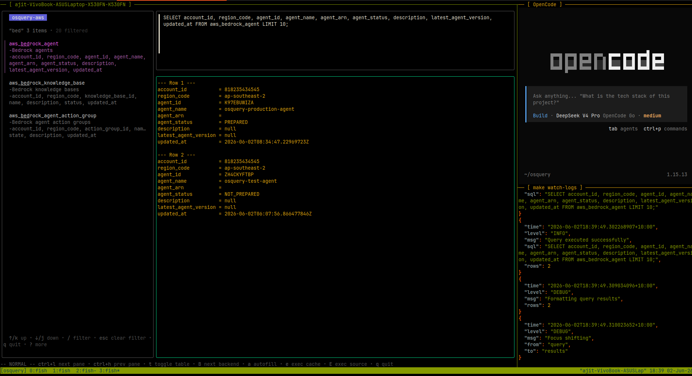
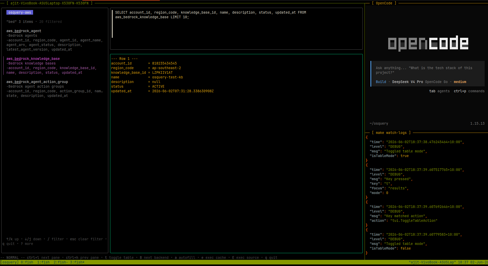
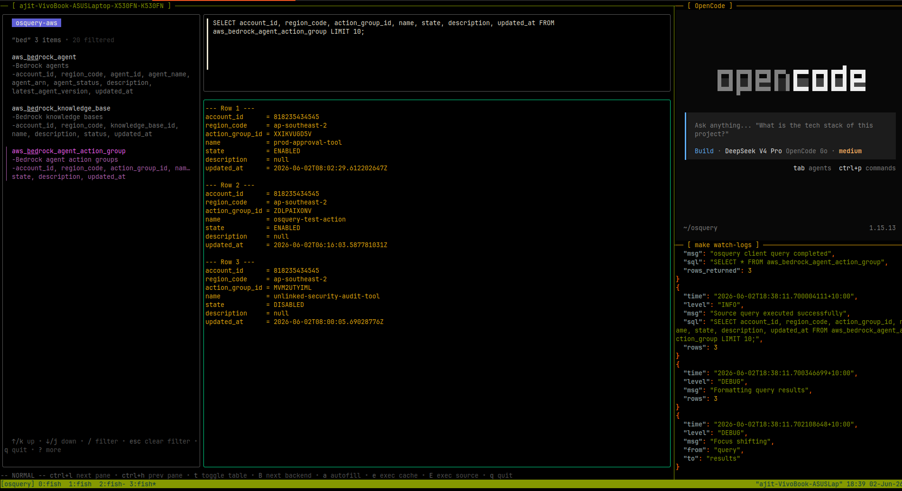
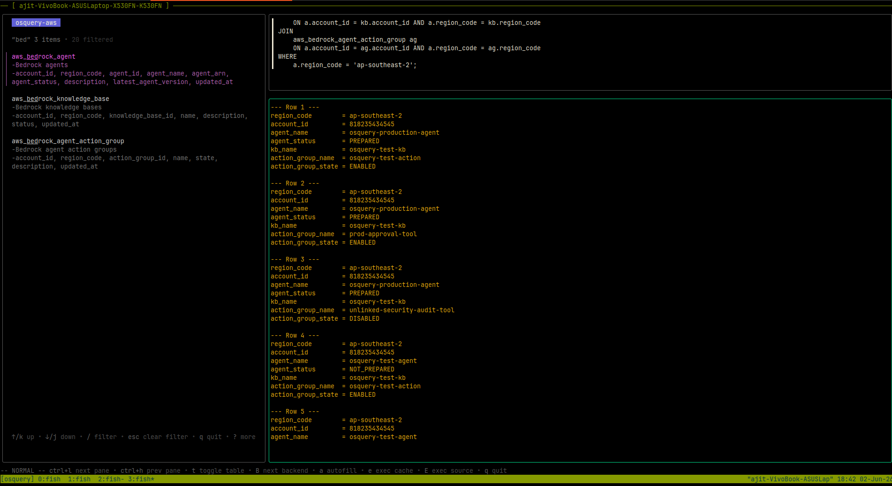
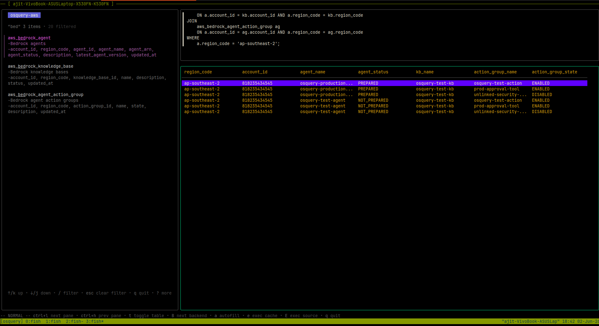
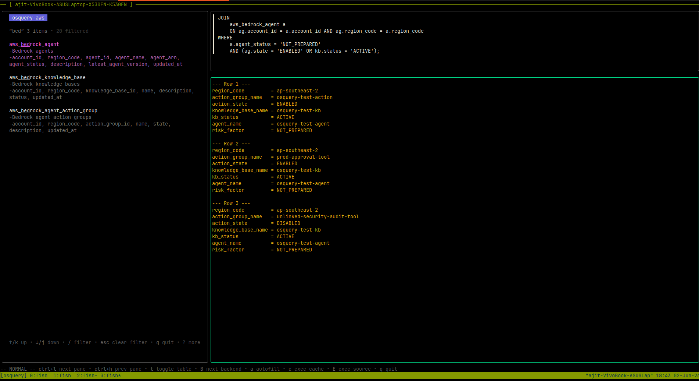
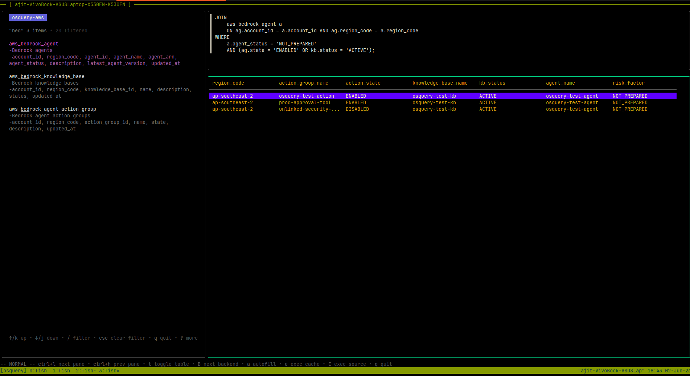
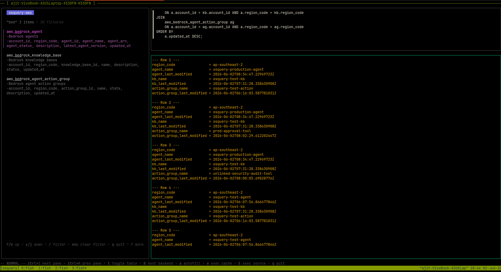
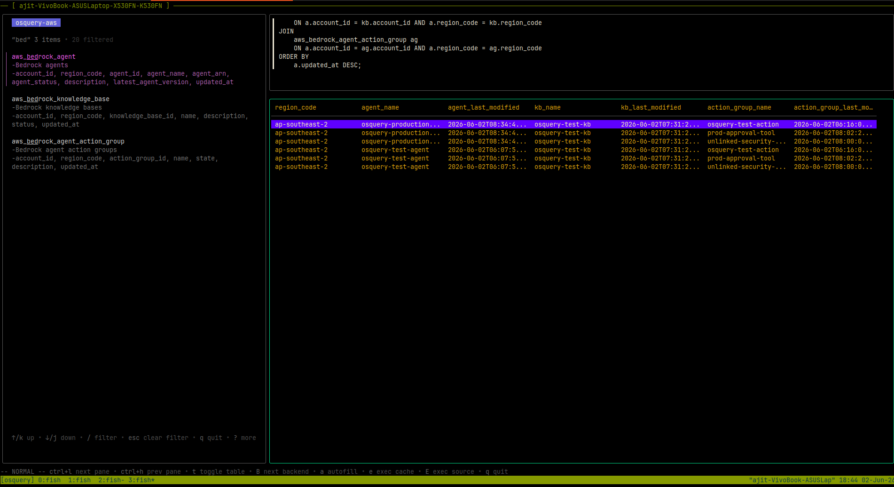

# AWS Bedrock Tables

Amazon Bedrock is a managed service that provides access to foundation models from leading AI companies through a unified API. Bedrock also includes capabilities for building AI agents, curating knowledge bases for Retrieval-Augmented Generation (RAG), and defining action groups that connect agents to external APIs and business logic. LazyOS surfaces Bedrock resources — agents, knowledge bases, and action groups — as queryable osquery tables, enabling security and compliance audits across AI infrastructure.

---

## Bedrock Agents

The `aws_bedrock_agent` table enumerates all Bedrock agents deployed across an AWS account. Each row represents a single agent with its identity, lifecycle status, version, and description. The `agent_status` distinguishes between active, preparing, and failed deployments. The `latest_agent_version` column tracks the most recently published agent revision.



*The `aws_bedrock_agent` table queried in LazyOS, showing all Bedrock agents with their status, ARN, version, and description columns.*

---

## Bedrock Knowledge Bases

The `aws_bedrock_knowledge_base` table lists every knowledge base configured in Bedrock. Knowledge bases index documents — stored in S3 or other data sources — and make them available to foundation models via RAG. The `status` column reports the operational state (`ACTIVE`, `CREATING`, `DELETING`). The `updated_at` timestamp helps identify stale or abandoned knowledge bases that may contain outdated source material.



*The `aws_bedrock_knowledge_base` table queried in LazyOS, displaying all knowledge bases with their status, name, and update timestamps.*

---

## Bedrock Agent Action Groups

The `aws_bedrock_agent_action_group` table exposes the action groups attached to Bedrock agents. Action groups define the tools an agent can invoke — Lambda functions, API schemas, or custom business logic — that execute when a model determines an action is needed during a conversation. The `state` column indicates whether the action group is `ENABLED` or `DISABLED`. This table is essential for auditing which external capabilities are wired into each AI agent.



*The `aws_bedrock_agent_action_group` table queried in LazyOS, showing all action groups with their name, state, description, and update timestamps.*

---

## Diagnostic Queries

The following queries join across all three Bedrock tables to answer security audit and operational compliance questions. Each is presented in both line mode and table mode.

---

### Query 1: Regional Blast-Radius and Exposure Audit

**Auditor Objective:** Surface the absolute operational footprint and data-exposure boundaries within a specific region. If an adversary gains access to a single agent or API key in `ap-southeast-2`, this query maps every possible lateral asset they could target.

**Join Strategy:** `INNER JOIN` across all three tables bound by the control-plane dimensions (`account_id` and `region_code`).

```sql
SELECT
    a.region_code,
    a.account_id,
    a.agent_name,
    a.agent_status,
    kb.name AS kb_name,
    ag.name AS action_group_name,
    ag.state AS action_group_state
FROM
    aws_bedrock_agent a
JOIN
    aws_bedrock_knowledge_base kb
    ON a.account_id = kb.account_id AND a.region_code = kb.region_code
JOIN
    aws_bedrock_agent_action_group ag
    ON a.account_id = ag.account_id AND a.region_code = ag.region_code
WHERE
    a.region_code = 'ap-southeast-2';
```

| Column | Description |
|---|---|
| `region_code` / `account_id` | Control-plane scope of the blast radius |
| `agent_name` | Identifying label for the agent resource |
| `agent_status` | Lifecycle state — `PREPARED` agents are deployable targets |
| `kb_name` | Associated knowledge base providing data context |
| `action_group_name` | Tools wired to the agent for execution |
| `action_group_state` | Whether the action group is `ENABLED` or `DISABLED` |

| Mode | Screenshot |
|---|---|
| **Line mode** — each row surfaces the full agent-to-knowledge-base-to-action-group chain for `ap-southeast-2`. |  |
| **Table mode** — columnar view of the regional blast radius across agents, knowledge bases, and action groups. |  |

---

### Query 2: Sub-Optimal and Stagnant Workload Audit

**Auditor Objective:** Catch deployment pipeline errors where actionable capabilities (active knowledge bases or enabled action tools) are lingering inside an environment, but the orchestrating agent is stuck in an undeployed or unbuilt state (`NOT_PREPARED`). This highlights stale compute and misconfigured environments.

**Join Strategy:** `INNER JOIN` combining all three tables, filtering on the agent state and tracking functional sub-resource availability.

```sql
SELECT
    ag.region_code,
    ag.name AS action_group_name,
    ag.state AS action_state,
    kb.name AS knowledge_base_name,
    kb.status AS kb_status,
    a.agent_name,
    a.agent_status AS risk_factor
FROM
    aws_bedrock_agent_action_group ag
JOIN
    aws_bedrock_knowledge_base kb
    ON ag.account_id = kb.account_id AND ag.region_code = kb.region_code
JOIN
    aws_bedrock_agent a
    ON ag.account_id = a.account_id AND ag.region_code = a.region_code
WHERE
    a.agent_status = 'NOT_PREPARED'
    AND (ag.state = 'ENABLED' OR kb.status = 'ACTIVE');
```

| Column | Description |
|---|---|
| `region_code` | AWS region of the stranded resources |
| `action_group_name` / `action_state` | Tool capability that is wired but unreachable |
| `knowledge_base_name` / `kb_status` | Data source that is active but not served by any agent |
| `agent_name` / `risk_factor` | The parent agent stuck at `NOT_PREPARED` |

| Mode | Screenshot |
|---|---|
| **Line mode** — exposing action groups and knowledge bases that are functional but attached to non-deployable agents. |  |
| **Table mode** — columnar listing of stranded sub-resources against `NOT_PREPARED` agents. |  |

---

### Query 3: Change-Window and Configuration Drift Tracker

**Auditor Objective:** Track state out-of-sync indicators. If an automated CI/CD pipeline pushes updates to an action group or a vector store, but the parent agent's configuration does not show a matching modification timestamp within the same change window, it points directly to infrastructure drift.

**Join Strategy:** Multi-table `JOIN` sorting the entire regional layout by the newest structural updates.

```sql
SELECT
    a.region_code,
    a.agent_name,
    a.updated_at AS agent_last_modified,
    kb.name AS kb_name,
    kb.updated_at AS kb_last_modified,
    ag.name AS action_group_name,
    ag.updated_at AS action_group_last_modified
FROM
    aws_bedrock_agent a
JOIN
    aws_bedrock_knowledge_base kb
    ON a.account_id = kb.account_id AND a.region_code = kb.region_code
JOIN
    aws_bedrock_agent_action_group ag
    ON a.account_id = ag.account_id AND a.region_code = ag.region_code
ORDER BY
    a.updated_at DESC;
```

| Column | Description |
|---|---|
| `region_code` | Scope of the drift analysis |
| `agent_name` / `agent_last_modified` | Parent agent and its last deployment timestamp |
| `kb_name` / `kb_last_modified` | Knowledge base and its last content update |
| `action_group_name` / `action_group_last_modified` | Action group and its last schema change |

**Reading the results:** Compare the three `*_last_modified` columns per row. A gap of hours or days between `agent_last_modified` and the sub-resource timestamps indicates the pipeline updated sub-resources but never redeployed the agent — a textbook drift scenario.

| Mode | Screenshot |
|---|---|
| **Line mode** — timestamp comparison across agents, knowledge bases, and action groups for drift detection. |  |
| **Table mode** — side-by-side `updated_at` columns enabling rapid drift identification across all three resource types. |  |
