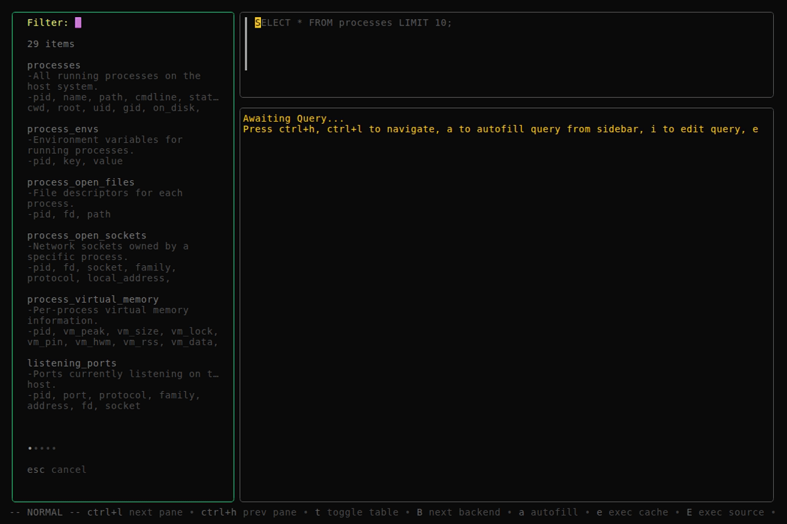

# Diagnostic Queries

This document catalogues diagnostic workflows that leverage osquery tables to surface actionable system characteristics. Each use case pairs a set of related tables with annotated SQL queries and an interpretation guide that explains what the numbers actually mean — not just what they are.

---

## Virtual Memory Inspection

### Understanding Linux Memory

Before running queries, it is important to understand the distinction between what the kernel tracks and what tools like `free -h` report. The kernel maintains counters for pages in several states:

| State | Column in `virtual_memory_info` | Meaning |
|---|---|---|
| Completely unallocated | `free` | Pages the kernel has assigned to nothing — not a process, not a file cache, not a slab. Truly empty. |
| File-backed cache | `file_pages` | Pages caching disk content. The kernel can drop these in microseconds when memory is needed. Reclaimable. |
| Inactive (mostly reclaimable) | `inactive` | Pages that have not been accessed recently. Most are clean cache pages waiting to be reclaimed. |
| Active (in use) | `active` | Pages actively referenced. Includes process memory and hot cache. Not easily reclaimable. |
| Anonymous (process memory) | `anon_pages` | Pages owned by processes — heap, stack, mmap. Cannot be dropped; must be swapped if evicted. |
| Kernel slab caches | `slab` | In-kernel data structures (dentries, inodes, network buffers). Partially reclaimable. |

On a healthy system, `free` is intentionally small — typically 3–5 GB on a 32 GB machine. The kernel aggressively repurposes idle RAM as disk cache (`file_pages`) because unused RAM is wasted RAM. When a process needs more memory, the kernel evicts cache pages instantly. Those pages were available all along; they just happened to have a temporary tenant.

The number most users care about — "how much RAM can I actually use right now?" — is `free` + `file_pages` + a portion of `inactive`. This is what `free -h` labels "available." The raw `free` column alone tells a misleadingly pessimistic story.

The real warning signs are not low `free` in isolation, but the combination of near-zero `free` with spiking `major_faults` (disk reads to satisfy memory access) or accelerating `swap_outs` (the kernel giving up and evicting process memory to disk).

### Diagnostic Workflow

Two queries together answer: is the system under memory pressure right now, and if so, which processes are responsible?

1. **Query 1 (System Pulse)** — a single-row snapshot of kernel VM counters. Run it once for a baseline, run it again after starting a workload, and compare the deltas.
2. **Query 2 (Process Breakdown)** — attributes physical memory (RSS), heap allocation, and swap to individual processes via a JOIN. Narrow and actionable.

### Required Tables

| Table | Source | Role |
|---|---|---|
| `virtual_memory_info` | `/proc/vmstat` | System-wide VM counters (faults, swap, paging, page states) |
| `process_virtual_memory` | `/proc/<pid>/status` | Per-process VM breakdown in bytes (RSS, heap, stack, swap) |
| `processes` | osquery process table | Process metadata for JOIN (name, path, cmdline) |

### Query 1: System Pulse

Captures a single snapshot of the kernel's virtual memory counters. All values are cumulative since boot, so the absolute numbers matter less than the rate of change between snapshots. Run it before and after a suspected memory-intensive workload and compare.

```sql
SELECT printf('%,.0f', free * 4096 / (1024.0*1024*1024)) || ' GB' AS unallocated_ram,
       swap_ins, swap_outs, faults, major_faults
FROM virtual_memory_info;
```

**Column guide:**

`unallocated_ram` — Pages the kernel has given zero purpose. No process owns them, no file is cached in them, no slab allocation uses them. On a healthy system this number is intentionally low because the kernel fills idle RAM with disk cache. A 32 GB machine showing 4 GB here is completely normal — the other 28 GB is busy caching files or serving processes, and most of the cache can be dropped instantly when needed.

To see the total reclaimable headroom (free + cache), add the columns that represent reclaimable pages:

```sql
SELECT printf('%,.0f', (free + file_pages + inactive) * 4096 / (1024.0*1024*1024)) || ' GB' AS reclaimable_ram
FROM virtual_memory_info;
```

This value maps roughly to the "available" column in `free -h`.

`swap_ins` — Cumulative count of pages pulled back from swap into RAM. Each entry is a page that was evicted to disk and later needed again. This counter only goes up. If it ticks up while your workload runs, pages that should be in RAM are living on disk.

`swap_outs` — Cumulative count of pages pushed out to swap. The kernel only swaps when it cannot free enough memory by dropping disk cache. A rising rate between snapshots means the system cannot keep everything resident.

`faults` — Total page faults, both minor and major. Minor faults are routine — the kernel handles millions per second under normal load (shared library mappings, copy-on-write). The absolute count is noise; the delta between snapshots and the ratio of major to total faults provide signal.

`major_faults` — Page faults that required disk I/O. Each major fault means the CPU stalled waiting for a read from storage. This is the metric that correlates with "my machine feels sluggish." A few major faults during startup are normal; hundreds per second during steady-state operation indicate a problem.

**Reading the results:**

| Situation | What it means |
|---|---|
| `unallocated_ram` low, `major_faults` flat | Normal. The kernel is using RAM for cache, not wasting it. No performance impact. |
| `unallocated_ram` near zero, `major_faults` rising | Real memory pressure. Processes are competing for pages and the kernel is hitting disk to satisfy requests. |
| `swap_outs` accelerating between snapshots | Sustained pressure. The kernel gave up on cache eviction alone and started pushing process memory to disk. |
| `major_faults` spiking during a specific operation | That operation is memory-bound. Either the dataset is too large for RAM, or there is a leak. |

### Query 2: Process Memory Breakdown

Attributes physical memory, heap allocation, and swap to individual processes. Only processes above 1 MB RSS are shown — filter out the noise.

```sql
SELECT p.pid, p.name,
       printf('%.0f', v.vm_rss / (1024.0*1024.0))  || ' MB' AS rss,
       printf('%.0f', v.vm_data / (1024.0*1024.0)) || ' MB' AS heap,
       CASE WHEN v.vm_swap > 0
            THEN printf('%.0f', v.vm_swap / (1024.0*1024.0)) || ' MB'
            ELSE '-'
       END AS swapped
FROM processes p
JOIN process_virtual_memory v ON p.pid = v.pid
WHERE v.vm_rss > 1024 * 1024
ORDER BY v.vm_rss DESC
LIMIT 15;
```

**Column guide:**

`rss` (vm_rss) — Resident Set Size: the physical pages currently mapped into the process. This is the actual RAM footprint — the number that contributes to "how much memory is this machine using." A process with 500 MB RSS is occupying 500 MB of physical RAM right now.

`heap` (vm_data) — The process's data segment, which contains the heap, BSS, and static data. This is what the process *requested* from the kernel via `malloc()`, `mmap()`, or `sbrk()`. It includes allocated-but-never-touched pages (over-allocation) and freed-but-not-returned pages (fragmentation). Seeing `heap` > `rss` is expected — the process asked for more than it currently touches. A Go program might request 100 MB of heap space but only RSS 40 MB because the garbage collector has not expanded the heap, or freed pages have not been returned to the OS. The gap between `heap` and `rss` is not a problem; it is how virtual memory works.

`swapped` (vm_swap) — Pages of this specific process that are sitting on disk. A dash (`-`) means the process is fully resident in RAM. Any numeric value means the kernel decided this process was not important enough to keep entirely in memory and evicted part of it to swap. If a process you care about shows `swapped` > 0, the system was under enough pressure at some point to sacrifice it.

**Reading the results:**

| Pattern | What it means |
|---|---|
| `rss` large, `swapped` = `-` | Heavy process, but fully resident. Normal for databases, browsers, IDEs. |
| `rss` large, `swapped` > 0 | Heavy process partially evicted. The kernel needed RAM badly enough to push part of it to disk. Performance will degrade whenever those swapped pages are accessed. |
| `heap` >> `rss` | Over-allocation. The process asked for more virtual memory than it uses. Common in JVM, Go, and Node.js runtimes. Not a problem unless the gap keeps growing (possible leak). |
| Multiple processes show `swapped` > 0 | System-wide memory pressure. The kernel is evicting from multiple processes, not just one offender. Correlate with Query 1's `swap_outs` delta. |

### Demonstration



*Both queries executed live in LazyOS — Query 1 captures the system pulse with kernel VM counters, Query 2 attributes physical memory, heap, and swap to individual processes via a JOIN across `processes` and `process_virtual_memory`.*
