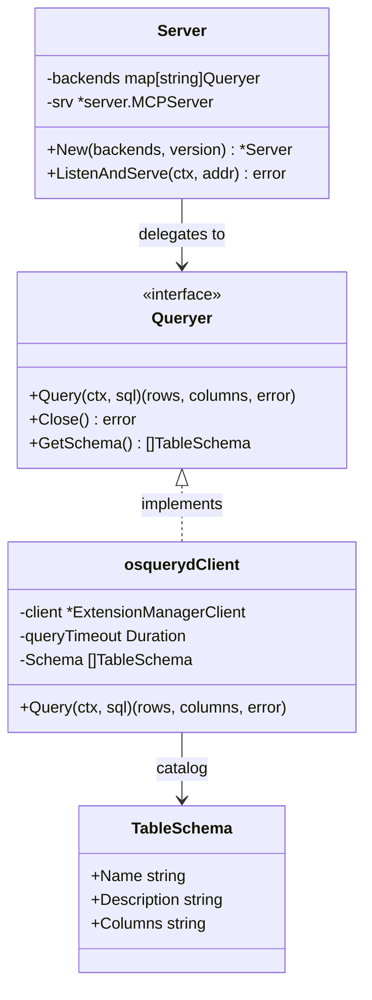
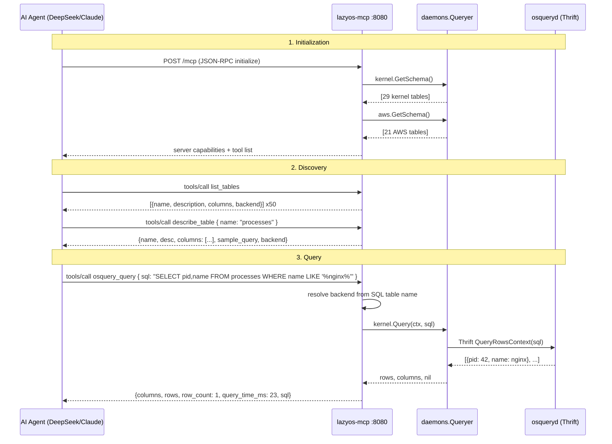
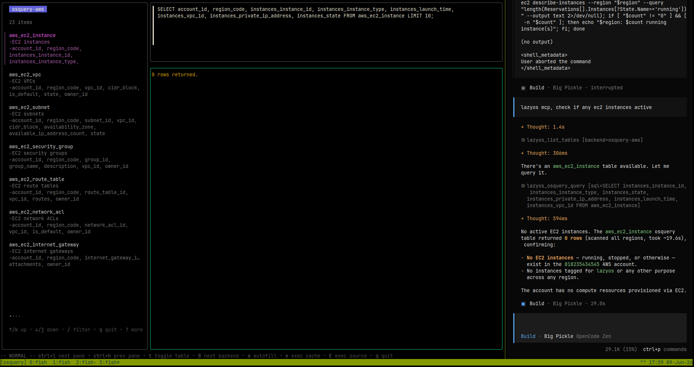
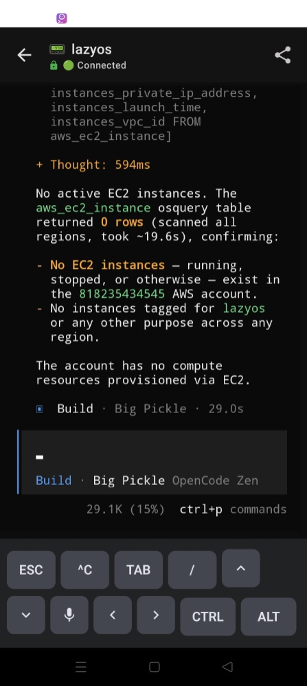

# MCP Server: AI-Native Osquery Access

This document describes the `lazyos-mcp` binary, a Model Context Protocol (MCP) server that exposes the full osquery table catalog and query engine to AI agents over standard HTTP. Through the MCP interface, AI agents can discover available tables, inspect schemas, and execute SQL queries against the live osquery daemon — all over a structured, protocol-driven interface.

## What is the Model Context Protocol?

The Model Context Protocol is an open standard (originated by Anthropic) that defines how AI applications communicate with external tools and data sources. It uses JSON-RPC 2.0 as its wire format and provides two transport mechanisms: stdio (for local, process-attached servers) and Streamable HTTP (for network-accessible servers).

An MCP server exposes three primitive types:

| Primitive | Purpose | LazyOS Usage |
|---|---|---|
| **Tools** | Callable functions the AI can invoke | `list_tables`, `describe_table`, `osquery_query` |
| **Resources** | Readable data the AI can ingest | (not yet implemented; future: `schema://{backend}/tables`) |
| **Prompts** | Reusable interaction templates | (not yet implemented; future: diagnostic query templates) |

For LazyOS, the MCP server enables AI agents to autonomously explore available osquery tables, understand their schemas, and execute SQL queries — all without any prior knowledge of the underlying data model.

## Architecture

The `lazyos-mcp` binary is a standalone process that shares zero runtime dependencies with the TUI. Both binaries connect to the same osqueryd Thrift socket independently and can run simultaneously.



The `Server` struct wraps the `mark3labs/mcp-go` MCP server and holds a map of backend name to `daemons.Queryer` interfaces. On startup, it iterates every backend's `GetSchema()` method to build the tool catalog dynamically — adding a new backend (e.g., GCP, Azure) requires zero changes to the MCP server code.

### Data Flow



### Transport: Streamable HTTP

The server uses MCP's Streamable HTTP transport, which operates over standard `POST` requests with JSON-RPC bodies. This enables:

- **Browser-based clients**: MCP requests from web apps or browser extensions
- **Remote AI agents**: AI hosts running on different machines (e.g., a phone accessing the server via Tailscale)
- **Standard HTTP tooling**: Debuggable with `curl`, proxyable through nginx/Caddy, observable via standard HTTP logs

The server binds to a configurable host and port. The default `127.0.0.1:8080` restricts access to localhost. For remote access, bind to `0.0.0.0` or a specific network interface.

## Tools Reference

### `list_tables`

Enumerate all available osquery tables across all enabled backends.

```
Input:
  backend  (string, optional) — filter to a single backend: "osquery-kernel", "osquery-aws"

Output:
  {
    "tables": [
      {
        "name": "processes",
        "description": "All running processes on the host system.",
        "columns": "pid, name, path, cmdline, state, cwd, root, uid, gid, ...",
        "backend": "osquery-kernel"
      },
      ...
    ],
    "count": 50
  }
```

The AI agent uses this to discover what data is available before constructing queries.

### `describe_table`

Get the full schema for a specific table, including a generated sample query.

```
Input:
  name  (string, required) — table name, e.g. "processes", "aws_ec2_instance"

Output:
  {
    "name": "processes",
    "description": "All running processes on the host system.",
    "columns": ["pid", "name", "path", "cmdline", "state", "cwd", ...],
    "backend": "osquery-kernel",
    "sample_query": "SELECT pid, name, path, cmdline, state, cwd, root, ... FROM processes LIMIT 10"
  }
```

The `sample_query` field provides a ready-to-execute SQL statement that the AI can pass directly to `osquery_query` — or modify to add filters, joins, and projections.

### `osquery_query`

Execute an arbitrary SQL query against the live osquery daemon.

```
Input:
  sql  (string, required) — any valid osquery SQL statement

Output:
  {
    "columns": ["pid", "name", "state"],
    "rows": [
      {"pid": "1", "name": "systemd", "state": "S"},
      {"pid": "42", "name": "nginx", "state": "S"}
    ],
    "row_count": 2,
    "backend": "osquery-kernel",
    "query_time_ms": 23,
    "sql": "SELECT pid, name, state FROM processes LIMIT 3"
  }
```

All osquery queries are read-only by protocol — the daemon supports no DML (INSERT, UPDATE, DELETE) or DDL. The server echoes the executed SQL and returns timing metadata so the AI can measure and optimize its queries.

The server resolves which backend handles the query by parsing the SQL `FROM` clause and matching the table name against each backend's schema catalog. If the table cannot be resolved, it falls back to trying each backend in registration order.

## Remote Access via Tailscale

The MCP server is designed to work with Tailscale for secure cross-network access without API keys, TLS certificates, or port forwarding.

```
┌──────────┐    Tailscale WireGuard    ┌──────────────┐    localhost    ┌──────────────┐
│  Phone    │ ◄──────────────────────► │  Tailnet       │ ◄─────────────►│  lazyos-mcp   │
│  (4G/WiFi)│    encrypted tunnel      │  100.x.x.x     │   :8080        │  (home server)│
└──────────┘                          └──────────────┘                └──────────────┘
```

**Setup (one-time):**

```bash
# Install Tailscale on the server running lazyos-mcp
curl -fsSL https://tailscale.com/install.sh | sh
sudo tailscale up

# Install Tailscale on your phone (App Store / Google Play)
# Sign in with the same account
```

**Starting the server for remote access:**

```bash
# Bind to all interfaces so Tailscale can route traffic
./lazyos-mcp --host 0.0.0.0 --port 8080 --backend kernel --backend aws

# Or use the Makefile target
make run-mcp-all
```

**Connecting from any device on the tailnet:**

```
http://100.87.154.62:8080/mcp
```

Where `100.87.154.62` is your server's Tailscale IP (find it with `tailscale ip -4`).

No API keys, no domains, no TLS certificates. The WireGuard tunnel provides transport encryption and authentication. All traffic between the phone and server is encrypted end-to-end regardless of the underlying network.

## OpenCode Integration

To connect an AI agent (DeepSeek via OpenCode, or any MCP-compatible client) to lazyos-mcp, configure the MCP endpoint:

```json
{
  "mcpServers": {
    "lazyos": {
      "type": "streamableHttp",
      "url": "http://127.0.0.1:8080/mcp"
    }
  }
}
```

For Tailscale access from a phone or remote machine:

```json
{
  "mcpServers": {
    "lazyos": {
      "type": "streamableHttp",
      "url": "http://100.87.154.62:8080/mcp"
    }
  }
}
```

Once configured, the AI agent sees three tools (`list_tables`, `describe_table`, `osquery_query`) and can autonomously:

1. Call `list_tables` to discover what data is available
2. Call `describe_table` to understand the schema of any table
3. Call `osquery_query` to execute arbitrary SQL and inspect results

## Remote Access in Practice

The images below demonstrate `lazyos-mcp` accessed from a mobile device over a Tailscale tunnel. OpenCode running through Termly on an Android phone connects to the MCP server on the home server, queries active AWS EC2 instances via `osquery_query`, and displays the result:

| Query via OpenCode on Termly | Phone session overview |
|:---:|:---:|
|  |  |
| *The AI agent answering the question* | *The phone running the Termly session* |

This workflow requires no port forwarding, no public DNS, and no TLS certificates — Tailscale WireGuard handles routing, authentication, and encryption. The MCP server binds to `0.0.0.0:8080` and accepts connections from any device on the tailnet.

## Usage

### Building

```bash
make build-mcp
```

Produces a `lazyos-mcp` binary in the project root.

### Running Locally

```bash
# Using make (kernel backend, localhost only)
make run-mcp

# Or directly, with explicit flags
./lazyos-mcp --osquery-socket /tmp/osquery.em --host 127.0.0.1 --port 8080 --backend kernel
```

### Running with All Backends (Tailscale-ready)

```bash
make run-mcp-all

# Or directly
./lazyos-mcp --osquery-socket /tmp/osquery.em --host 0.0.0.0 --port 8080 --backend kernel --backend aws
```

### CLI Flags

| Flag | Default | Description |
|---|---|---|
| `--osquery-socket` | `/tmp/osquery.em` | Path to the osquery extension socket |
| `--osquery-startup-timeout` | `10s` | Thrift initial connection timeout |
| `--osquery-query-timeout` | `100s` | Per-query timeout |
| `--backend` | `[kernel]` | Backends to enable: `kernel`, `aws` (repeatable flag) |
| `--host` | `127.0.0.1` | HTTP server bind address |
| `--port` | `8080` | HTTP server bind port |

### Testing with curl

```bash
# list_tables
curl -s -X POST http://127.0.0.1:8080/mcp \
  -H 'Content-Type: application/json' \
  -d '{"jsonrpc":"2.0","id":1,"method":"tools/call","params":{"name":"list_tables","arguments":{}}}' \
  | python3 -m json.tool

# osquery_query — top 5 processes by memory
curl -s -X POST http://127.0.0.1:8080/mcp \
  -H 'Content-Type: application/json' \
  -d '{"jsonrpc":"2.0","id":2,"method":"tools/call","params":{"name":"osquery_query","arguments":{"sql":"SELECT pid, name, resident_size FROM processes ORDER BY resident_size DESC LIMIT 5"}}}' \
  | python3 -m json.tool
```

## Security Considerations

| Concern | Mitigation |
|---|---|
| **Network exposure** | Defaults to `127.0.0.1`. Requires explicit `--host 0.0.0.0` for remote access |
| **Transport security** | Tailscale WireGuard provides authenticated encryption for remote access |
| **Query safety** | osquery protocol is read-only — no DML or DDL support in the daemon |
| **Resource exhaustion** | Query timeout inherits from `--osquery-query-timeout` (default 100s). Complex queries that exceed the deadline are cancelled |
| **Information disclosure** | All tables are exposed. Run with `--backend kernel` only if AWS resource data should not be accessible |

## Package Structure

```
cmd/lazyos-mcp/main.go          Binary entry point (77 lines)
internal/mcp/server.go          MCP server struct, tool registration, lifecycle (114 lines)
internal/mcp/tools.go           Three tool handler implementations (141 lines)
internal/mcp/server_test.go     Mock-driven unit tests (183 lines, 8 test cases)
internal/bootstrap/bootstrap.go Shared backend initialization (65 lines)
```

The MCP server reuses the existing `daemons.Queryer` interface, `osqueryd.Client` Thrift wrapper, and schema catalogs from `internal/daemons/osqueryd/aws` and `internal/daemons/osqueryd/kernel`. No new Thrift or osquery code was added — the MCP layer is purely a protocol adapter.
