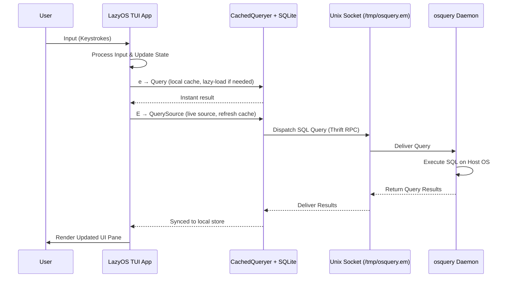
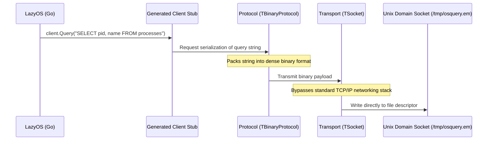
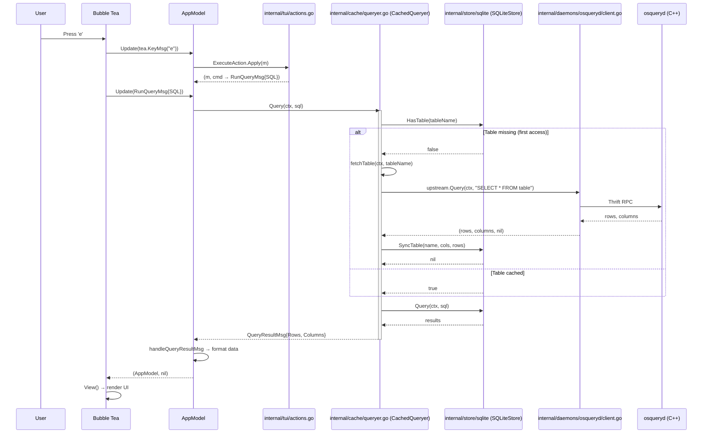
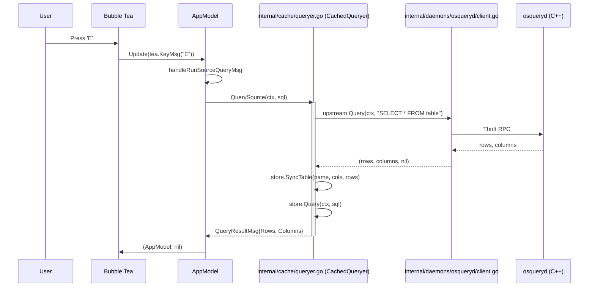
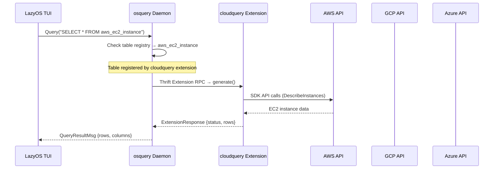

# External Interaction: LazyOS and osquery

This document details the external interaction between LazyOS and the host operating system via the osquery daemon.

## What is osquery?

osquery is an open-source operating system instrumentation framework created by Facebook. It exposes an operating system as a high-performance relational database. This allows you to write SQL queries to explore OS data such as running processes, loaded kernel modules, open network connections, browser plugins, hardware events, and file hashes.

## The osquery-go Extension

LazyOS interacts with osquery using the `osquery-go` library. Instead of shelling out to the `osqueryi` command-line tool, `osquery-go` allows Go applications to communicate directly with a running `osqueryd` daemon. It achieves this by acting as an Extension API client that connects to osquery's extension socket (usually located at `/tmp/osquery.em` or `/var/osquery/osquery.em` on UNIX systems).

## The Interaction Flow



## What is Thrift RPC?

Apache Thrift is a software framework for scalable cross-language services development. It combines a software stack with a code generation engine to build services that work efficiently and seamlessly between many programming languages. In the context of osquery, Thrift is used as the underlying Remote Procedure Call (RPC) mechanism to send messages (like SQL queries and their results) back and forth between the osquery daemon and extensions (like LazyOS).

### The Thrift Architecture

To understand how Thrift operates under the hood, it is helpful to compare it to gRPC. Just as gRPC relies on Protocol Buffers (`.proto` files) and the `protoc` compiler, Thrift has its own equivalent ecosystem.

#### 1. The Interface Definition Language (IDL)

Thrift uses `.thrift` files to define the strict contract between the client (LazyOS) and the server (osqueryd). These files define the data structures and the service methods available.

Here is a conceptual, simplified snippet demonstrating what an osquery `.thrift` file looks like:

```thrift
namespace go osquery.extensions

// Defines the structure of a status message
struct ExtensionStatus {
  1: i32 code,
  2: string message,
}

// Defines the structure of the data returned by a query
struct ExtensionResponse {
  1: ExtensionStatus status,
  2: list<map<string, string>> response,
}

// Defines the actual RPC service and its available methods
service ExtensionManager {
  ExtensionResponse query(1: string sql)
}
```

#### 2. The Thrift Compiler

Similar to how gRPC requires `protoc`, Thrift requires the `thrift` compiler executable.

During the development of the `osquery-go` SDK (which LazyOS relies on), a generation step is performed (e.g., `thrift --gen go osquery.thrift`). This compiler parses the `.thrift` file and generates the low-level Go code:

* **Structs:** Native Go representations of `ExtensionResponse` and `ExtensionStatus`.
* **Serialization:** The optimized functions required to pack these structs into a binary format and unpack them.
* **Client Stubs:** A client object that exposes a `query(sql string)` method. This encapsulates the network logic, allowing the application to call the remote osquery daemon as a standard Go function.

#### 3. The Layered Network Stack

Thrift is designed as a modular, layered stack. This architecture allows osquery to utilize the most efficient combination of serialization and transport mechanisms for local OS instrumentation.

The following sequence illustrates the traversal of a SQL query through these layers:



* **Protocol Layer (`TBinaryProtocol`):** osquery uses a compact binary protocol rather than human-readable text (like JSON). This makes serializing and deserializing the massive amounts of data generated by OS metrics extremely fast and CPU-efficient.
* **Transport Layer (`TSocket`):** Instead of using standard TCP/IP network sockets (which introduce kernel network stack overhead), osquery defaults to Unix Domain Sockets. These are file-system based sockets that bypass the networking stack entirely, providing ultra-low latency, high-throughput Inter-Process Communication (IPC) on the same machine.
* **Socket Permissions:** Unix domain sockets require **write** permission to connect (unix(7): "The `connect()` call requires write permission on the socket file"). osqueryd creates its socket with mode `0755` by default, meaning only `root` can connect. For remote-tunnel setups where SSH connects as a non-root user, the socket must be explicitly widened (e.g., `chmod 0777` via a systemd `ExecStartPost`). See [Remote Deployment: osqueryd Daemon Quirks](./remote_deployment.md#osqueryd-daemon-quirks) for details.

### Thrift vs. gRPC

While both Thrift and gRPC are RPC frameworks used for inter-process communication, they have different design philosophies and ecosystems:

| Feature | Apache Thrift | gRPC |
| :--- | :--- | :--- |
| **Origin** | Facebook (now Apache) | Google |
| **Transport** | Custom TCP/Unix sockets | HTTP/2 |
| **Serialization** | Binary, Compact, JSON | Protocol Buffers (Protobuf) |
| **Language Support** | Very broad | Broad (growing rapidly) |
| **Usage in osquery**| Native (Built-in) | Not natively used for extension API |

### Benefits of Thrift for osquery

1. **Performance over Local Sockets:** Thrift's binary protocol over local Unix domain sockets provides extremely low latency and high throughput, which is critical for real-time OS instrumentation.
2. **Ecosystem Compatibility:** osquery chose Thrift early in its development lifecycle, meaning all official and community extensions rely on it for stable, reliable communication.
3. **Language Agnostic:** It allows extensions to be written in Go (like LazyOS), Python, C++, or Rust while seamlessly interacting with the C++ core of osquery.
4. **Self-Contained Protocol:** It does not require a heavy HTTP/2 stack like gRPC, making it lightweight and suitable for system-level daemons.

## Data Flow

### Column Resolution

Column names are resolved from the osquery response data when rows are present, with a schema fallback for empty results:

1. **Response-derived (rows > 0)**: Column names are extracted from the first row's map keys. This preserves computed expressions like `size / 1024 AS mb` and reflects exactly what the SELECT clause requested — no extra schema columns are injected.
2. **Schema fallback (rows == 0)**: When osquery returns zero rows, column names are derived from the schema catalog in `internal/daemons/osqueryd/*/schema.go` via `DeriveColumnsFromSchema`, ensuring the TUI can render column headers even with no data.
3. **No columns**: If both the response and the schema catalog are empty, nil columns are returned and the TUI renders a headerless "0 rows returned." view.

### Cached Query Execution



### Source Query Execution



## Timeout Handling

The `executeThriftQuery` method in `internal/daemons/osqueryd/client.go` passes the deadline-bearing context through to the osquery-go client via `QueryRowsContext` instead of `Query`. This ensures the osquery-go socket locker uses its `MaxWaitTime` (set to match the configured query timeout) rather than falling back to its very short internal default when multiple goroutines contend for the shared Unix socket.

## cloudquery: Cloud Resource Instrumentation

cloudquery is an osquery extension that adds cloud provider telemetry tables to the osquery schema. It is maintained as a separate project at [ajitm722/cloudquery](https://github.com/ajitm722/cloudquery) and runs alongside osqueryd to expose AWS, GCP, and Azure resources as queryable SQL tables.

### Extension Architecture

cloudquery registers itself with osqueryd as an extension plugin. When osqueryd receives a query referencing a cloud table (e.g., `aws_ec2_instance`), it delegates execution to the cloudquery extension process over the Thrift extension socket. The extension authenticates against the configured cloud provider APIs, fetches live resource data, and returns it to osqueryd as standard query result rows.



### Supported Cloud Providers

| Provider | Namespace | Example Tables |
|---|---|---|
| AWS | `aws_*` | `aws_ec2_instance`, `aws_s3_bucket`, `aws_iam_user`, `aws_rds_instance`, `aws_ecs_cluster` |
| GCP | `gcp_*` | `gcp_compute_instance`, `gcp_compute_network`, `gcp_storage_bucket` |
| Azure | `azure_*` | `azure_compute_vm`, `azure_storage_account`, `azure_network_vnet` |

Full table catalogs are maintained at:
- [extension/aws/tables.md](https://github.com/ajitm722/cloudquery/blob/master/extension/aws/tables.md)
- [extension/gcp/tables.md](https://github.com/ajitm722/cloudquery/blob/master/extension/gcp/tables.md)
- [extension/azure/tables.md](https://github.com/ajitm722/cloudquery/blob/master/extension/azure/tables.md)

### Configuration

cloudquery reads its configuration from a JSON file (`extension_config.json`), which specifies:

- **Cloud accounts**: One or more accounts per provider with credentials, regions, and optional role assumptions.
- **Logging**: Log file path and verbosity level.
- **Provider-specific settings**: Request rate limits, API endpoint overrides, and cache TTLs.

Credentials are passed as file paths within this config:
- **AWS**: A shared credentials file (`~/.aws/credentials`) with a named profile.
- **GCP**: A service account JSON key file.
- **Azure**: An auth file containing service principal credentials, plus `subscriptionId` and `tenantId`.

### Deployment with osqueryd

cloudquery is deployed as a compiled Go binary (`cloudquery.ext`) that osqueryd loads at startup via its extension autoload mechanism:

1. **Build and install**: `make && sudo make install` places the binary at `/usr/local/bin/cloudquery.ext`.
2. **Register with osqueryd**: Add `/usr/local/bin/cloudquery.ext` to `/etc/osquery/extensions.load`.
3. **Enable autoload**: Ensure `--extensions_autoload=/etc/osquery/extensions.load` is present in osqueryd flags.
4. **Restart osqueryd**: `sudo service osqueryd restart`.

### Integration with LazyOS

LazyOS treats cloudquery tables identically to native osquery tables. The `aws` backend in LazyOS's schema catalog (`internal/daemons/osqueryd/aws/schema.go`) enumerates the AWS tables exposed by cloudquery. When the user selects the `aws` backend (via `B` keybinding or `--backend aws` flag), the sidebar populates with these tables and queries are routed to the same osqueryd socket that cloudquery extends.

The caching layer (`internal/cache/`) applies uniformly across all backends: both kernel and cloud tables benefit from lazy-loaded SQLite persistence. Source queries (`E`) refresh cloud tables from the live cloud APIs, while cached queries (`e`) serve data from the local store instantly.
