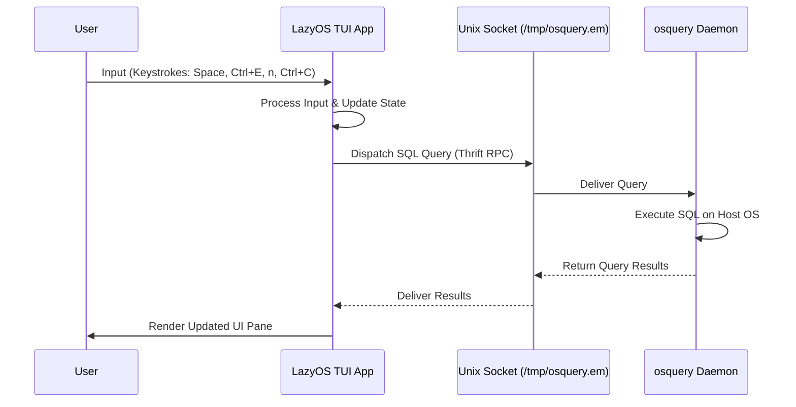
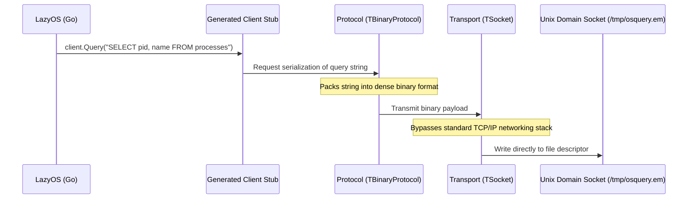
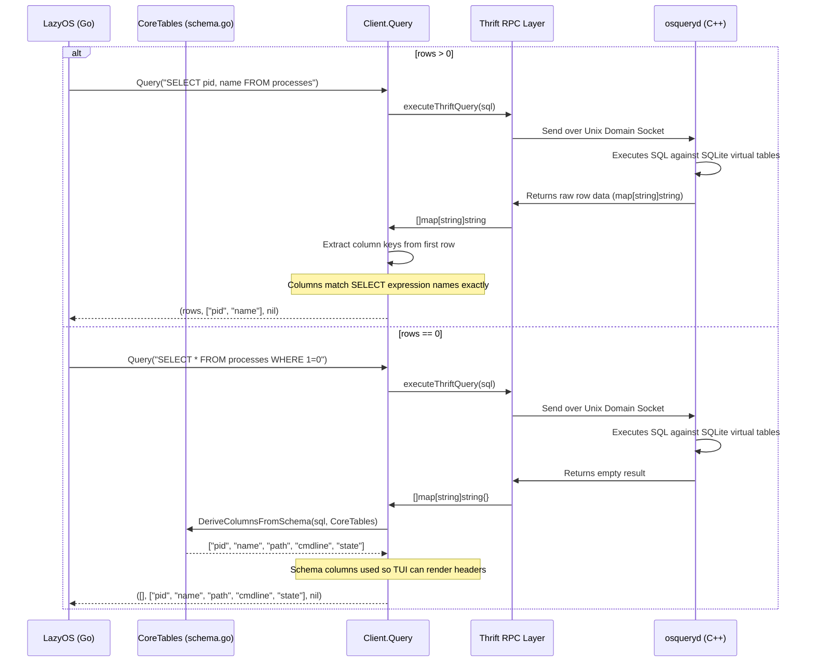
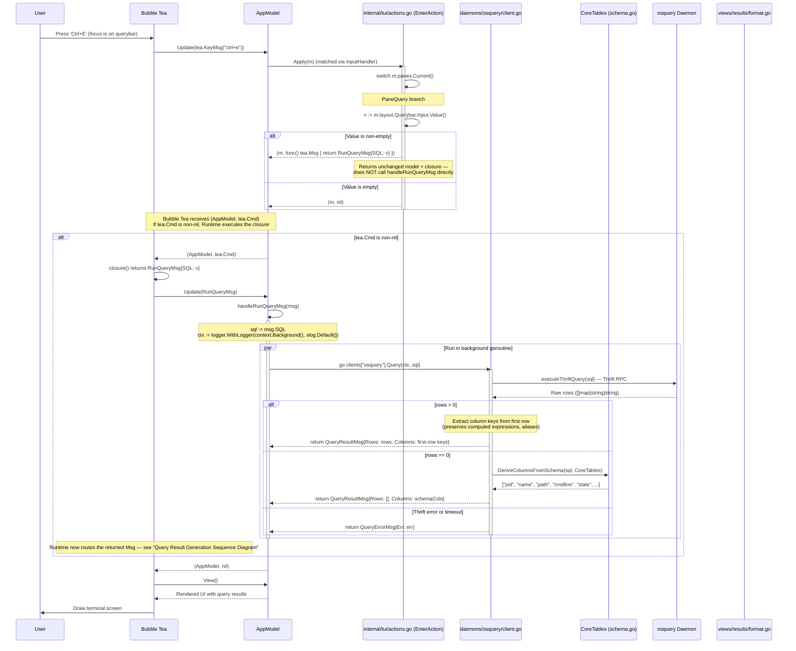

# External Interaction: LazyOS and osquery

This document details the external interaction between LazyOS and the host operating system via the osquery daemon.

## What is osquery?

osquery is an open-source operating system instrumentation framework created by Facebook. It exposes an operating system as a high-performance relational database. This allows you to write SQL queries to explore OS data such as running processes, loaded kernel modules, open network connections, browser plugins, hardware events, and file hashes.

## The osquery-go Extension

LazyOS interacts with osquery using the `osquery-go` library. Instead of shelling out to the `osqueryi` command-line tool, `osquery-go` allows Go applications to communicate directly with a running `osqueryd` daemon. It achieves this by acting as an Extension API client that connects to osquery's extension socket (usually located at `/tmp/osquery.em` or `/var/osquery/osquery.em` on UNIX systems).

## The Interaction Flow



## What is Thrift RPC?

Apache Thrift is a software framework for scalable cross-language services development. It combines a software stack with a code generation engine to build services that work efficiently and seamlessly between many programming languages. In the context of osquery, Thrift is used as the underlying Remote Procedure Call (RPC) mechanism to send messages (like SQL queries and their results) back and forth between the osquery daemon and extensions (like LazyOS).

### The Thrift Architecture

To understand how Thrift operates under the hood, it is helpful to compare it to gRPC. Just as gRPC relies on Protocol Buffers (`.proto` files) and the `protoc` compiler, Thrift has its own equivalent ecosystem.

#### 1. The Interface Definition Language (IDL)

Thrift uses `.thrift` files to define the strict contract between the client (LazyOS) and the server (osqueryd). These files define the data structures and the service methods available.

Here is a conceptual, simplified snippet demonstrating what an osquery `.thrift` file looks like:

```thrift
namespace go osquery.extensions

// Defines the structure of a status message
struct ExtensionStatus {
  1: i32 code,
  2: string message,
}

// Defines the structure of the data returned by a query
struct ExtensionResponse {
  1: ExtensionStatus status,
  2: list<map<string, string>> response,
}

// Defines the actual RPC service and its available methods
service ExtensionManager {
  ExtensionResponse query(1: string sql)
}
```

#### 2. The Thrift Compiler

Similar to how gRPC requires `protoc`, Thrift requires the `thrift` compiler executable.

During the development of the `osquery-go` SDK (which LazyOS relies on), a generation step is performed (e.g., `thrift --gen go osquery.thrift`). This compiler parses the `.thrift` file and generates the low-level Go code:

* **Structs:** Native Go representations of `ExtensionResponse` and `ExtensionStatus`.
* **Serialization:** The optimized functions required to pack these structs into a binary format and unpack them.
* **Client Stubs:** A client object that exposes a `query(sql string)` method. This encapsulates the network logic, allowing the application to call the remote osquery daemon as a standard Go function.

#### 3. The Layered Network Stack

Thrift is designed as a modular, layered stack. This architecture allows osquery to utilize the most efficient combination of serialization and transport mechanisms for local OS instrumentation.

The following sequence illustrates the traversal of a SQL query through these layers:



* **Protocol Layer (`TBinaryProtocol`):** osquery uses a compact binary protocol rather than human-readable text (like JSON). This makes serializing and deserializing the massive amounts of data generated by OS metrics extremely fast and CPU-efficient.
* **Transport Layer (`TSocket`):** Instead of using standard TCP/IP network sockets (which introduce kernel network stack overhead), osquery defaults to Unix Domain Sockets. These are file-system based sockets that bypass the networking stack entirely, providing ultra-low latency, high-throughput Inter-Process Communication (IPC) on the same machine.

### Thrift vs. gRPC

While both Thrift and gRPC are RPC frameworks used for inter-process communication, they have different design philosophies and ecosystems:

| Feature | Apache Thrift | gRPC |
| :--- | :--- | :--- |
| **Origin** | Facebook (now Apache) | Google |
| **Transport** | Custom TCP/Unix sockets | HTTP/2 |
| **Serialization** | Binary, Compact, JSON | Protocol Buffers (Protobuf) |
| **Language Support** | Very broad | Broad (growing rapidly) |
| **Usage in osquery**| Native (Built-in) | Not natively used for extension API |

### Benefits of Thrift for osquery

1. **Performance over Local Sockets:** Thrift's binary protocol over local Unix domain sockets provides extremely low latency and high throughput, which is critical for real-time OS instrumentation.
2. **Ecosystem Compatibility:** osquery chose Thrift early in its development lifecycle, meaning all official and community extensions rely on it for stable, reliable communication.
3. **Language Agnostic:** It allows extensions to be written in Go (like LazyOS), Python, C++, or Rust while seamlessly interacting with the C++ core of osquery.
4. **Self-Contained Protocol:** It does not require a heavy HTTP/2 stack like gRPC, making it lightweight and suitable for system-level daemons.

## Data Flow

### Schema Validation

The `CoreTables` catalog in `internal/daemons/osquery/schema.go` is validated against the live daemon in the integration test suite. Every declared column is checked via `PRAGMA table_info` to ensure it exists in the actual osquery schema, and every table is verified to be queryable with `SELECT COUNT(*)`. See `docs/osquery_integration_test.md` for details.

### Column Resolution

Column names are resolved from the osquery response data when rows are present, with a schema fallback for empty results:

1. **Response-derived (rows > 0)**: Column names are extracted from the first row's map keys. This preserves computed expressions like `size / 1024 AS mb` and reflects exactly what the SELECT clause requested — no extra schema columns are injected.
2. **Schema fallback (rows == 0)**: When osquery returns zero rows, column names are derived from `CoreTables` in `internal/daemons/osquery/schema.go` (e.g., `"pid, name, path, cmdline, state"`) via `DeriveColumnsFromSchema`, ensuring the TUI can render column headers even with no data.
3. **No columns**: If both the response and the schema catalog are empty, nil columns are returned and the TUI renders a headerless "0 rows returned." view.



---

## Asynchronous Query Execution

This flow details the most complex interaction: entering a SQL query, pressing Ctrl+E, and watching results appear. The query is dispatched to a background goroutine to keep the UI responsive.

### Source Files

| Step | File | Key Function / Type |
|------|------|-------------------|
| Enter action | `internal/tui/actions.go:64` | `EnterAction.Apply(m)` |
| Query dispatch | `internal/tui/app.go:136` | `handleRunQueryMsg(msg)` |
| Column resolution (rows > 0) | `internal/daemons/osquery/client.go:89` | Extract keys from first row's map — preserves computed expressions exactly |
| Column resolution (rows == 0) | `internal/daemons/columns.go:41` | `DeriveColumnsFromSchema(sql, schema)` — parses SQL for `FROM` table, looks up in schema catalog |
| osquery RPC | `internal/daemons/osquery/client.go:38` | `Client.executeThriftQuery(sql)` — returns raw rows only (no columns) |
| osquery Query | `internal/daemons/osquery/client.go:51` | `Client.Query(ctx, sql)` — calls `executeThriftQuery`, then resolves columns from response (rows > 0) or schema (rows == 0) |
| Result message | `internal/tui/messages.go:17` | `QueryResultMsg{Rows, Columns}` |
| Error message | `internal/tui/messages.go:22` | `QueryErrorMsg{Err}` |
| Result formatting | `internal/tui/app.go:149` | `handleQueryResultMsg(msg)` |
| Error formatting | `internal/tui/app.go:165` | `handleQueryErrorMsg(msg)` |
| Data rendering | `internal/tui/views/results/format.go:23` | `results.FormatData(rowsData, columns)` |
| Error rendering | `internal/tui/views/results/format.go:152` | `results.FormatError(err)` |

### Diagram



