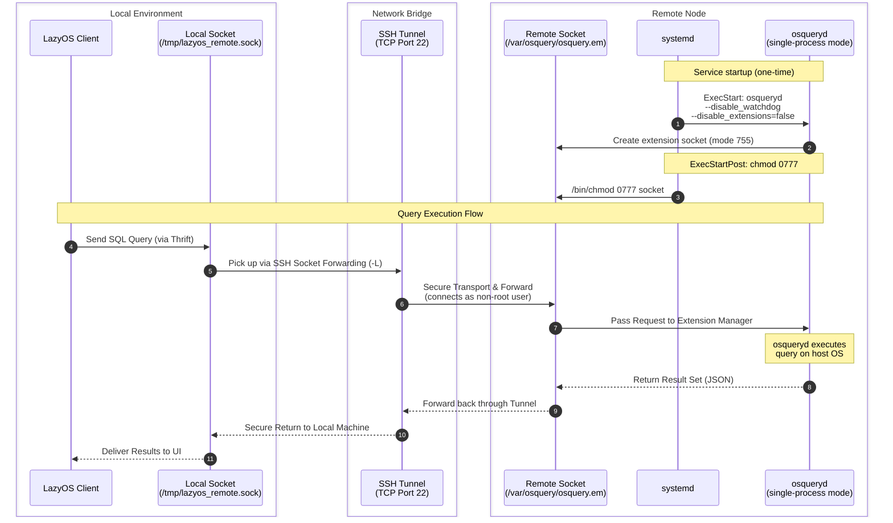

# Provision osquery on a Remote Node and Connect with LazyOS

This guide walks through deploying osqueryd on a remote Linux machine, configuring it to expose a known socket path, and connecting LazyOS to it via SSH socket forwarding — with zero code changes to the Go application.

If you already have a Linux machine with SSH access (a Raspberry Pi, a pre-existing VM, any cloud instance), jump to [Step 2 — Configure osqueryd with Ansible](#step-2--configure-osqueryd-with-ansible). Otherwise, Step 1 provisions a new EC2 instance with OpenTofu.

## Architecture Overview

LazyOS communicates with osqueryd over a local UNIX socket. Rather than modifying LazyOS to speak TLS or HTTP, we use SSH socket forwarding (`-L`) to bridge the local LazyOS client to a remote osqueryd socket as if it were local.

The provisioning pipeline has three stages:

1. **OpenTofu** (optional) — provisions an EC2 instance and writes a dynamic Ansible inventory
2. **Ansible** — installs osqueryd, configures the socket path with a systemd drop-in, and starts the service
3. **SSH Tunnel** — forwards the remote socket to a local file path so LazyOS can use it

### osqueryd Daemon Quirks

Two critical details were discovered during integration:

1. **osqueryd's watcher/worker fork ignores CLI flags.** The `osqueryd` watcher process spawns a worker via `exec()` without the original command-line arguments. The flagfile is read by the watcher but **not passed to the worker**. The worker starts with shell-mode defaults (`disable_extensions=true`, `extensions_socket=/root/.osquery/shell.em`). The fix is `--disable_watchdog`, which forces single-process mode so all CLI flags take effect directly.

2. **Unix sockets require write permission to connect.** osqueryd creates its socket with mode `0755` (`rwxr-xr-x`). Connecting to a Unix domain socket requires **write** permission on the socket file. Since the SSH tunnel connects as the `admin` (or `ubuntu` etc.) user — not `root` — SSH's remote connection fails with `Permission denied` and the local tunnel is reset (`connection reset by peer`). The fix is a systemd `ExecStartPost` that chmods the socket to `0777` after osqueryd starts.

### Data Flow

When LazyOS sends a query, the data travels through this path:

```text
LazyOS Client → Local Socket (/tmp/lazyos_remote.sock)
    → SSH Tunnel (TCP 22) → Remote Socket (/var/osquery/osquery.em)
    → osqueryd → executes on host → result flows back
```

## Prerequisites

- [Ansible](https://docs.ansible.com/) >= 2.16
- A Linux machine with SSH access and a sudo-capable user (or AWS credentials if provisioning via OpenTofu)
- An SSH key pair — the private key on your local machine, the public key on the remote machine

### Create an SSH Key Pair (if needed)

```bash
ssh-keygen -t ed25519 -f ~/.ssh/lazyos-key -N ""
```

For EC2 provisioning, import the public key into AWS — **the `--region` must match the `region` you set in `terraform.tfvars`**:

```bash
aws ec2 import-key-pair \
  --key-name lazyos-key \
  --public-key-material fileb://~/.ssh/lazyos-key.pub \
  --region ap-southeast-2
```

> If the region in `terraform.tfvars` and the `--region` flag do not match, `tofu apply` will fail with `InvalidKeyPair.NotFound`.

---

## Step 1 (Optional) — Provision a New EC2 Instance with OpenTofu

If you already have a target machine, skip to [Step 2](#step-2--configure-osqueryd-with-ansible).

### 1a — Configure OpenTofu Variables

```bash
cp osquery_remote_exec/aws_ec2_node/terraform.tfvars.example osquery_remote_exec/aws_ec2_node/terraform.tfvars
```

Edit `terraform.tfvars` — **`ssh_key_name` is required and must match an existing AWS key pair name**:

```hcl
region        = "ap-southeast-2"
instance_type = "t3.micro"
os            = "ubuntu"              # ubuntu | debian | amazon-linux
ssh_key_name  = "<YOUR-KEY-PAIR-NAME>"   # ← this must exist in your AWS account in the same region
name_prefix   = "lazyos"
```

The `os` variable selects the operating system. Each value maps to a different AMI:

| Variable      | Distribution   | Default SSH User | AMI Owner     |
|---------------|----------------|------------------|---------------|
| `ubuntu`      | Ubuntu LTS     | `ubuntu`         | Canonical     |
| `debian`      | Debian stable  | `admin`          | Debian        |
| `amazon-linux`| Amazon Linux 2 | `ec2-user`       | Amazon        |

### 1b — Provision

```bash
cd osquery_remote_exec/aws_ec2_node
tofu init
tofu plan
tofu apply -auto-approve
```

When `apply` finishes, OpenTofu outputs the instance details:

```
Outputs:

instance_id = "i-0abc123def456"
public_ip   = "54.123.45.67"
private_ip  = "10.0.1.5"
os          = "ubuntu"
ssh_user    = "ubuntu"
ssh_connection_string = "ssh -i <your-key.pem> ubuntu@54.123.45.67"
ssh_tunnel_command     = "ssh -fNT -L /tmp/lazyos_remote.sock:/var/osquery/osquery.em -o ExitOnForwardFailure=yes -o ServerAliveInterval=30 ubuntu@54.123.45.67 -i <your-key.pem>"
```

The security group allows SSH (port 22) from the CIDR blocks specified in `ssh_cidr_blocks` (defaults to `0.0.0.0/0` — lock this down before production use). OpenTofu also writes an inventory file at `osquery_remote_exec/ansible/inventory.ini` with the new instance's IP address and SSH user.

### Verify the Instance

```bash
ssh -i ~/.ssh/lazyos-key ubuntu@$(tofu output -raw public_ip) whoami
```

Should print `ubuntu`.

---

## Step 2 — Configure osqueryd with Ansible

This step works whether you used OpenTofu or have an existing machine.

If you have an existing machine (no Terraform), first create a static inventory:

```bash
cd osquery_remote_exec/ansible

# Replace with your machine's IP and SSH user
echo '<machine-ip> ansible_user=<ssh-user>' > inventory.ini
```

Then run the playbook:

```bash
# After OpenTofu (inventory already generated):
cd osquery_remote_exec/ansible
ansible-playbook -i inventory.ini playbook.yml -u ubuntu --key-file ~/.ssh/lazyos-key

# Or for an existing machine:
ansible-playbook -i inventory.ini playbook.yml -u <ssh-user> --key-file ~/.ssh/your-key
```

The playbook performs the following steps:

1. **Detects the OS family** (`Debian` for Ubuntu/Debian, `RedHat` for Amazon Linux)
2. **Adds the official osquery repository** — apt key + source list for Debian-family, yum repo file for RedHat-family
3. **Installs the `osquery` package** via the system package manager
4. **Writes `/etc/osquery/osquery.flags`** with `--disable_extensions=false` and `--extensions_socket=/var/osquery/osquery.em`
5. **Writes the osqueryd environment file** (`/etc/default/osqueryd`) defining `FLAG_FILE`, `CONFIG_FILE`, and `PIDFILE`
6. **Creates a systemd drop-in directory** at `/etc/systemd/system/osqueryd.service.d/`
7. **Installs a systemd drop-in** (`socket-override.conf`) that:
   - Passes `--disable_watchdog` (prevents the watcher/worker fork from stripping CLI flags)
   - Passes `--disable_extensions=false` and `--extensions_socket=/var/osquery/osquery.em` directly to the process
   - Runs `ExecStartPost=/bin/bash -c 'sleep 1 && chmod 0777 /var/osquery/osquery.em'` so the SSH tunnel (non-root) can connect
8. **Enables and starts the `osqueryd` systemd service**

### Verify osqueryd is Running

```bash
ssh -i ~/.ssh/lazyos-key ubuntu@<ip> sudo systemctl status osqueryd
```

Should show `active (running)`.

```bash
ssh -i ~/.ssh/lazyos-key ubuntu@<ip> sudo osqueryi "SELECT * FROM osquery_info;"
```

Note that `osquery_flags` may report `disable_extensions=true` even though the extension manager is running correctly. This is because osqueryd has two separate flag registries — gflags (which the extension manager checks) and its own internal `Flag` registry (which the `osquery_flags` table reads). Flags set via `--flagfile` or the command line update gflags but may not update the internal registry, causing a cosmetic discrepancy. Verify `extensions=active` in `osquery_info` to confirm the Thrift server is running.

---

## Step 3 — Open the SSH Tunnel

In a dedicated terminal, run the SSH socket forward:

```bash
ssh -fNT \
  -L /tmp/lazyos_remote.sock:/var/osquery/osquery.em \
  -o ExitOnForwardFailure=yes \
  -o ServerAliveInterval=30 \
  <ssh-user>@<ip> -i ~/.ssh/lazyos-key
```

| Flag | Meaning |
|------|---------|
| `-fNT` | Background mode, no TTY, no command — pure tunnel |
| `-L /tmp/lazyos_remote.sock:/var/osquery/osquery.em` | Forward local file path to remote UNIX socket |
| `-o ExitOnForwardFailure=yes` | Exit immediately if the remote port/socket is unreachable (avoids silent failures) |
| `-o ServerAliveInterval=30` | Send keepalive every 30s to prevent NAT/firewall timeouts |
| `<user>@<ip>` | SSH user and public IP of the remote instance |

Keep this terminal open (or let `-f` daemonize it). As long as this tunnel runs, any process reading from `/tmp/lazyos_remote.sock` on your local machine is transparently talking to osqueryd on the remote instance.

### Verify the Tunnel

```bash
ls -la /tmp/lazyos_remote.sock
```

Should show a socket file. Test the tunnel by running osqueryi locally:

```bash
osqueryi --socket /tmp/lazyos_remote.sock "SELECT COUNT(*) AS total FROM processes;"
```

---

## Step 4 — Run LazyOS Against the Remote Node

With the SSH tunnel running, launch LazyOS using the interactive Makefile target and enter the forwarded socket path:

```bash
make run
```

When prompted, enter `/tmp/lazyos_remote.sock` for the socket path:

```
Configuring LazyOS (press Enter to accept defaults)...

  Config File [~/.config/lazyos/config.yml]:
  OSQuery Socket Path [/tmp/osquery.em]: /tmp/lazyos_remote.sock
  Startup Timeout [2s]:
  Query Timeout [10s]:
  Log File [~/.local/state/lazyos/lazyos.log]:
  Keep Log File? (true/false) [false]:
```

For a non-interactive one-liner (bypass the prompts), pass the socket directly:

```bash
go run ./cmd/lazyos --osquery-socket /tmp/lazyos_remote.sock
```

LazyOS is completely unaware that the socket is tunneled across a network. It opens, reads, and writes to the local file path just as it would with a local osqueryd. SSH handles all encryption, transport, and forwarding transparently.

---

## The Complete Query Flow



---

## Tear Down

### 1. Kill the LazyOS Client

If LazyOS is still running, quit it with `Ctrl+C` in its terminal, or kill it from this terminal:

```bash
pkill -f 'lazyos.*lazyos_remote.sock'
```

### 2. Stop the SSH Tunnel

```bash
pkill -f 'ssh.*lazyos_remote.sock'
```

Verify the tunnel process is gone:

```bash
ps aux | grep 'ssh.*lazyos' | grep -v grep
# should print nothing — the grep -v filters out the grep command itself
```

> If anything still appears (like a LazyOS process), it means the application is still running — see Step 1.

### 3. Remove the Local Socket File

```bash
rm -f /tmp/lazyos_remote.sock
```

### 4. Destroy the Remote Infrastructure

**If you provisioned with OpenTofu** — this terminates the EC2 instance, deletes the security group, and removes all associated AWS resources:

```bash
cd osquery_remote_exec/aws_ec2_node
tofu destroy -auto-approve
```

**If you used a standalone machine** — just stop the osqueryd service:

```bash
ssh <user>@<ip> sudo systemctl stop osqueryd
```

### 5. (Optional) Remove the Ansible Inventory

```bash
rm -f osquery_remote_exec/ansible/inventory.ini
```

The inventory file is auto-generated by OpenTofu and will be recreated on the next `tofu apply`. If you manage it manually, truncate or delete it as needed.

## Troubleshooting

| Symptom | Likely Cause | Fix |
|---------|-------------|------|
| `tofu apply` hangs | Missing AWS credentials | Run `aws configure` or set `AWS_ACCESS_KEY_ID`/`AWS_SECRET_ACCESS_KEY` |
| SSH connection refused | Security group or network ACL | Verify `ssh_cidr_blocks` includes your IP; check VPC routing |
| `ansible-playbook` fails with `permission denied` | SSH user mismatch | Verify SSH user matches the OS: `ubuntu` for Ubuntu, `admin` for Debian, `ec2-user` for Amazon Linux |
| osqueryd service not found | Package repo not configured | Run playbook again; check `/etc/osquery/osquery.flags` exists |
| Socket `/tmp/lazyos_remote.sock` not created | Tunnel not running | Confirm SSH tunnel process is alive; check for `"bind: address already in use"` |
| LazyOS reports connection refused | Tunnel is up but osqueryd is down | SSH into the instance and check `sudo systemctl status osqueryd` |
| Go Thrift client: `read: connection reset by peer` | SSH tunnel connects as non-root but socket is `755` (world lacks write) | The Ansible playbook now sets `ExecStartPost` to chmod the socket to `0777`. If the issue persists, verify with `ssh <user>@<ip> ls -la /var/osquery/osquery.em` — should show `srwxrwxrwx` |
| `osquery_flags` shows `disable_extensions=true` even though extension manager is running | Cosmetics only — osqueryd has two flag registries (gflags + internal `Flag`). `osquery_flags` reads the internal registry, which doesn't reflect gflags set via `--flagfile` | Verify `extensions=active` in the `osquery_info` table instead. If present, the Thrift server is running and the flags are correct |
