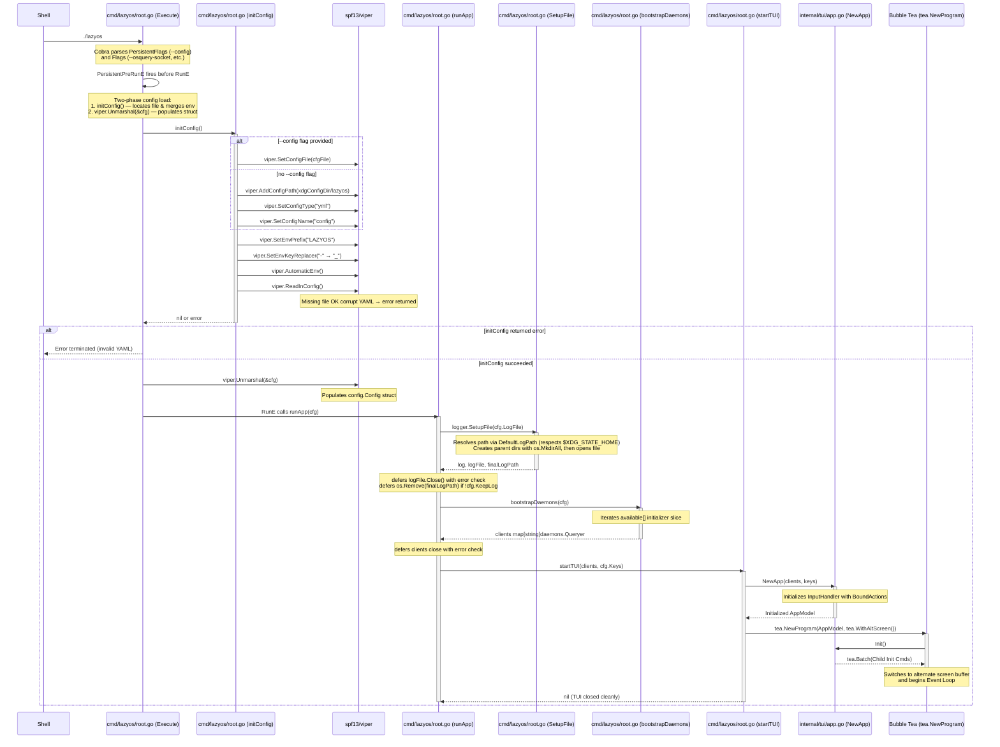
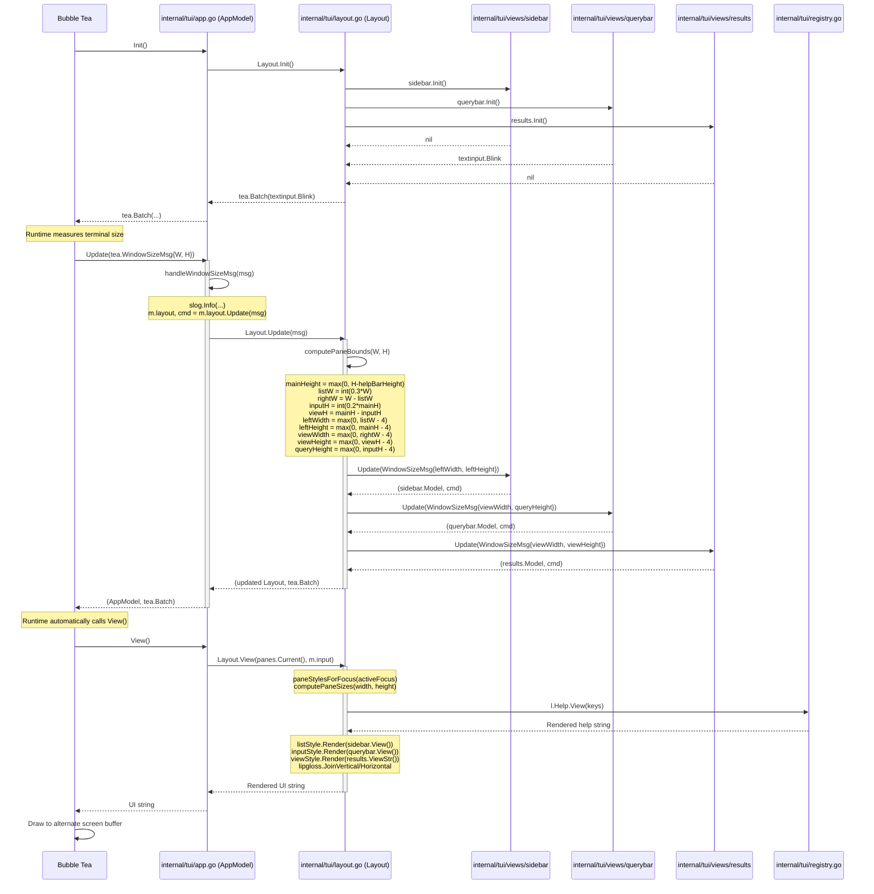
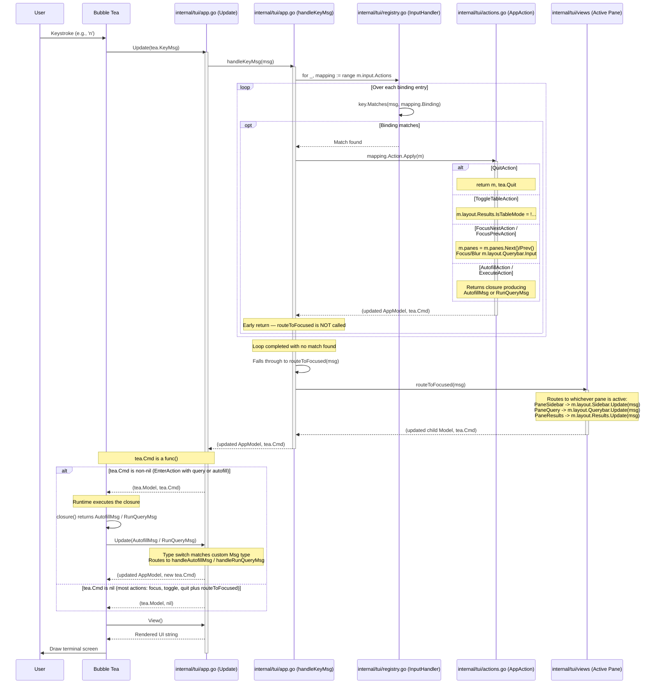
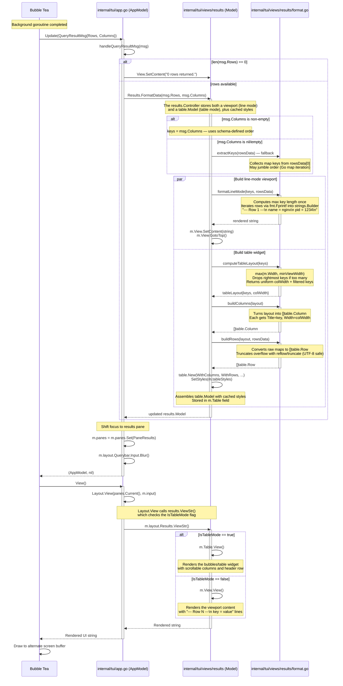
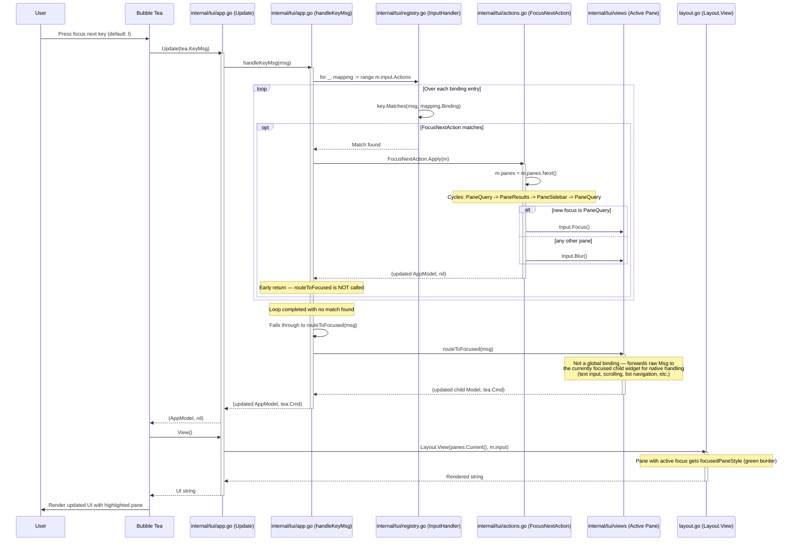

# Sequence Flows

The following sequence diagrams detail the internal data flow and component interactions within the `tui` package during key user operations. Each diagram is annotated with the exact source files and code snippets that make the flow work, enabling a new developer to trace every message from the terminal all the way to the osquery daemon and back.

---

## 1. Application Bootstrap

This flow traces the startup path from the shell through Viper configuration loading, the construction of the AppModel (including semantic key bindings and the InputHandler), and the initialization of the Bubble Tea runtime.

### Source Files

| Step | File | Key Function / Type |
|------|------|-------------------|
| CLI entry | `cmd/lazyos/main.go:15` | `main()` |
| Command registration | `cmd/lazyos/root.go:124` | `Execute(ctx)` / `rootCmd` |
| Config loading | `cmd/lazyos/root.go:131` | `initConfig()` via `PersistentPreRunE` |
| Config schema | `internal/config/config.go:15` | `Config` struct |
| Logger setup | `cmd/lazyos/root.go:58` | `runApp` / `SetupFile` |
| Daemon bootstrap | `cmd/lazyos/root.go:102` | `bootstrapDaemons(cfg)` via `runApp` |
| TUI construction | `internal/tui/app.go:51` | `NewApp(clients, cfg.Keys)` |
| Input handling | `internal/tui/registry.go:22` | `NewInputHandler(cfg)` |
| Program start | `cmd/lazyos/root.go:93` | `startTUI(...)` calls `tea.NewProgram` |

### Diagram

---

## 2. Bubble Tea Runtime Initialization

This flow shows what happens immediately after `tea.NewProgram` is called: the synthetic `WindowSizeMsg`, dimension calculation, and the first render.

### Source Files

| Step | File | Key Function / Type |
|------|------|-------------------|
| Program start | `cmd/lazyos/root.go:52` | `tea.NewProgram(...)` |
| Init command | `internal/tui/app.go:66` | `AppModel.Init()` |
| Window resize | `internal/tui/app.go:106` | `handleWindowSizeMsg(msg)` |
| Layout bounds | `internal/tui/layout.go:77` | `computePaneBounds(width, height)` |
| Layout update | `internal/tui/layout.go:89` | `Layout.Update(msg)` |
| View render | `internal/tui/layout.go:166` | `Layout.View(...)` |

### Diagram

---

## 3. Command Pattern: Key Event Handling

Keystrokes arrive as `tea.KeyMsg` values and are routed through `handleKeyMsg`, which iterates the `InputHandler.Actions` slice to find a matching `key.Binding`. Each `BoundAction` in the slice couples a binding to its corresponding `AppAction` implementation. On a match, the action's `Apply` method is invoked, mutating `AppModel` and returning an optional `tea.Cmd`. If no global binding matches, the message is forwarded to the currently focused child pane via `routeToFocused`.

### Source Files

| Step | File | Key Function / Type |
|------|------|-------------------|
| Message dispatch | `internal/tui/app.go:72` | `AppModel.Update(msg)` |
| Key routing | `internal/tui/app.go:94` | `handleKeyMsg(msg)` |
| Registry iteration | `internal/tui/registry.go:19` | `InputHandler.Actions` (slice) |
| Action execution | `internal/tui/actions.go:10` | `AppAction.Apply(m)` |
| Action impls | `internal/tui/actions.go:15-100` | `QuitAction`, `ToggleTableAction`, `FocusNextAction`, `FocusPrevAction`, `AutofillAction`, `ExecuteAction` |
| Fallback routing | `internal/tui/app.go:172` | `routeToFocused(msg)` |

### Diagram

---

## 4. Query Result Generation Pipeline

This flow details the second half of the query lifecycle: once the background goroutine returns a `QueryResultMsg`, the results are formatted into both a line-mode viewport string and a column-based table widget, and focus shifts to the results pane. Both representations are generated side-by-side so the user can toggle between them without re-querying. The `results.Model` acts as the orchestrator — it receives data from `FormatData`, delegates formatting to `format.go`, stores both representations, and dispatches rendering via `ViewStr()` based on the active mode.

### Source Files

| Step | File | Key Function / Type |
|------|------|-------------------|
| Result dispatch | `internal/tui/app.go:149` | `handleQueryResultMsg(msg)` |
| Format orchestrator | `internal/tui/views/results/results.go:18` | `Model` — holds View, Table, IsTableMode, Width, Height |
| Data formatting | `internal/tui/views/results/format.go:23` | `Model.FormatData(rowsData, columns)` — accepts ordered column names from schema |
| Ordered key resolution | `internal/tui/views/results/format.go:26` | `keys = columns` — uses `columns` argument when non-empty; falls back to `extractKeys(rowsData)` only when nil |
| Key extraction (fallback) | `internal/tui/views/results/format.go:44` | `extractKeys(rowsData)` — map-iteration fallback (may jumble order) |
| Line-mode render | `internal/tui/views/results/format.go:58` | `formatLineMode(keys, rowsData)` |
| Column layout | `internal/tui/views/results/format.go:86` | `Model.computeTableLayout(keys)` |
| Column builder | `internal/tui/views/results/format.go:104` | `buildColumns(layout)` |
| Row builder | `internal/tui/views/results/format.go:115` | `buildRows(layout, rowsData)` |
| Table assembly | `internal/tui/views/results/format.go:138` | `Model.buildTableMode(keys, rowsData)` |
| View switching | `internal/tui/views/results/format.go:152` | `Model.FormatError(err)` |
| Focus shift | `internal/tui/app.go:157-159` | `m.panes.Set(PaneResults)`, `Input.Blur()` |
| Mode dispatch | `internal/tui/views/results/results.go:92` | `Model.ViewStr()` — selects View or Table based on IsTableMode |
| Resize handling | `internal/tui/views/results/results.go:77` | `Model.handleWindowResize()` — updates Width/Height/bounds |

### Diagram

---

## 5. Pane Navigation (Focus Next/Prev)

This flow illustrates the specific execution of `FocusNextAction` when a user presses the focus next key (default: l) or `FocusPrevAction` (default: h). The action advances/reverses `activeFocus` through the three panes and manages `Focus`/`Blur` on the text input.

The diagram also shows the two-layer key routing architecture: `handleKeyMsg` first checks a small set of global bindings (including focus navigation). If a binding matches, the corresponding `AppAction` is executed. If **no** global binding matches (e.g. typing a character, pressing Backspace, or arrow keys for scrolling), the message falls through to `routeToFocused`, which forwards the raw `tea.Msg` to whichever child widget currently has focus — letting that widget handle it natively (text input, viewport scrolling, list navigation, etc.) without needing an explicit binding entry.

### Source Files

| Step | File | Key Function / Type |
|------|------|-------------------|
| Cycle action | `internal/tui/actions.go:31` | `FocusNextAction.Apply(m)` / `FocusPrevAction.Apply(m)` |
| Focus state | `internal/tui/pane.go:12` | `PaneManager` struct |
| Input focus | `internal/tui/views/querybar/input.go:20` | `querybar.Model.Input.Focus()` / `.Blur()` |
| Render | `internal/tui/app.go:190` | `AppModel.View()` |

### Diagram

