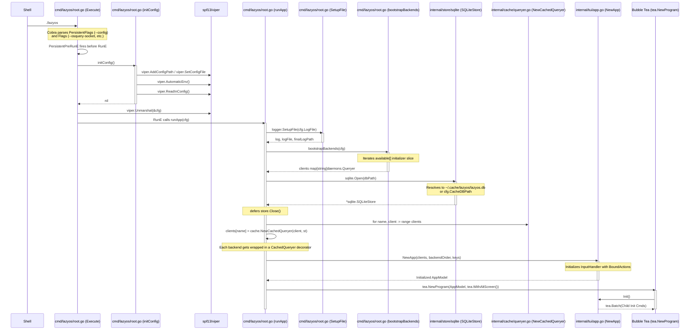
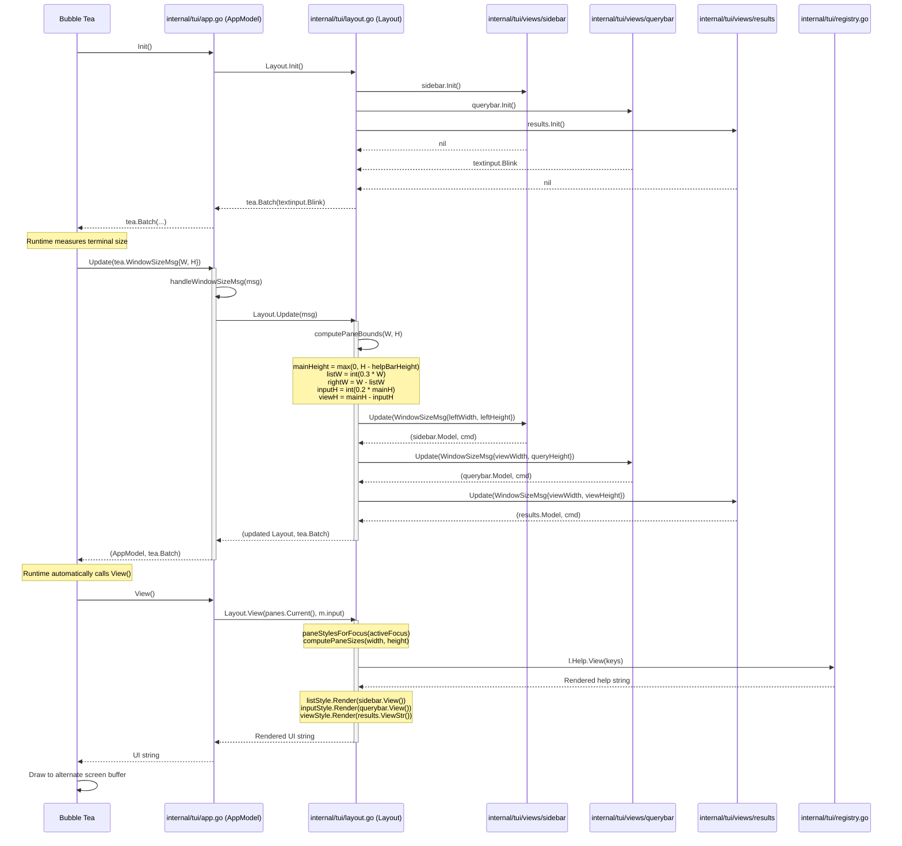
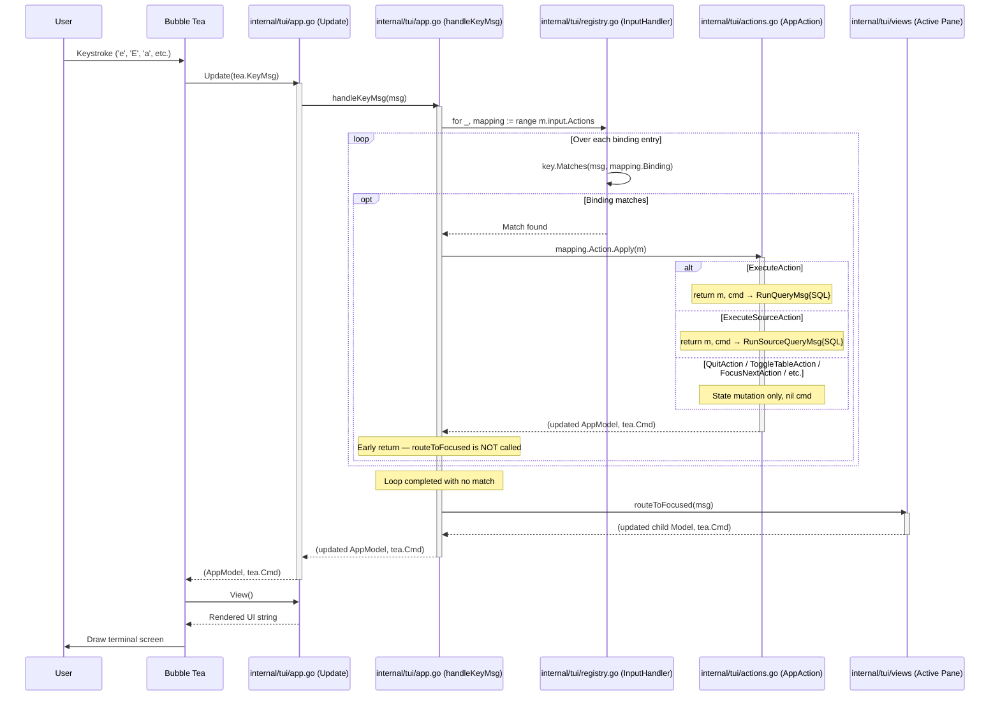
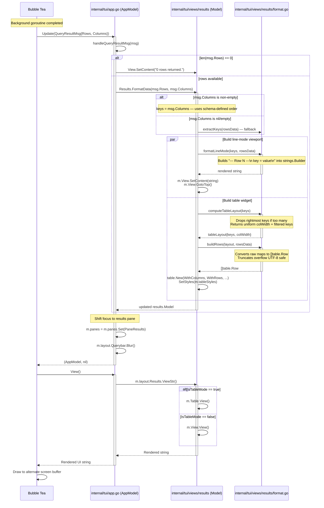
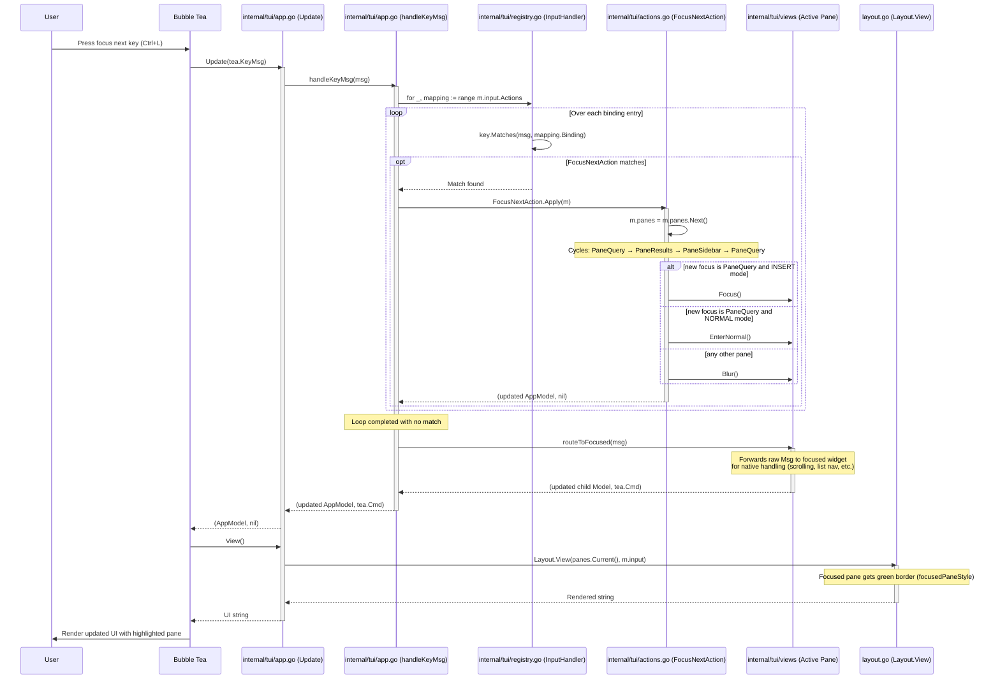
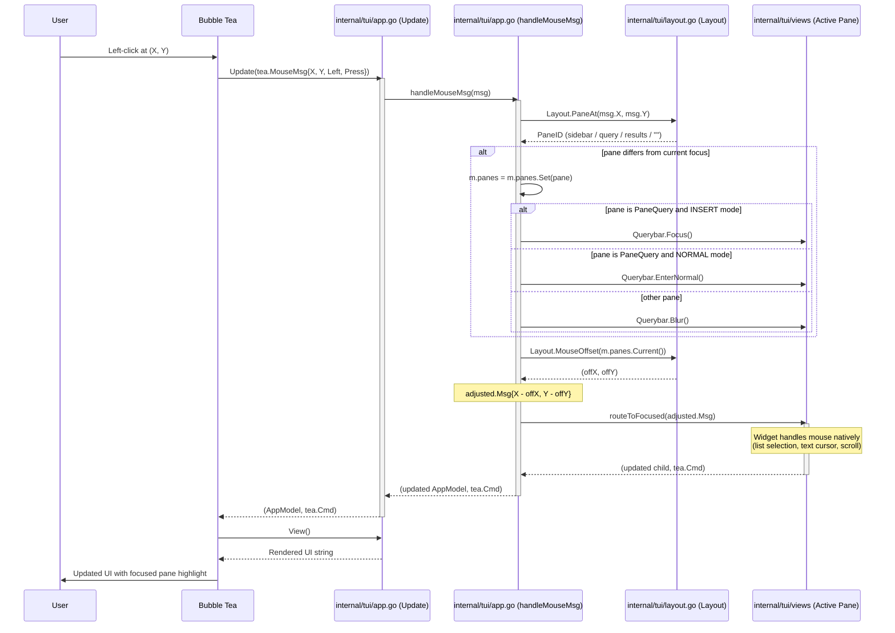

# Sequence Flows

The following sequence diagrams detail the internal data flow and component interactions within the `tui` package during key user operations. Each diagram is annotated with the exact source files that make the flow work, enabling a developer to trace every message from the terminal to the caching layer and the upstream daemon.

---

## 1. Application Bootstrap

This flow traces the startup path from the shell through Viper configuration loading, backend bootstrap, SQLite store initialisation, `CachedQueryer` wrapping, TUI construction, and Bubble Tea runtime start.

### Source Files

| Step | File | Key Function / Type |
|------|------|-------------------|
| CLI entry | `cmd/lazyos/main.go:15` | `main()` |
| Command registration | `cmd/lazyos/root.go` | `Execute(ctx)` / `rootCmd` |
| Config loading | `cmd/lazyos/root.go` | `initConfig()` via `PersistentPreRunE` |
| Config schema | `internal/config/config.go` | `Config` struct |
| Logger setup | `cmd/lazyos/root.go` | `runApp` / `SetupFile` |
| Backend bootstrap | `cmd/lazyos/root.go` | `bootstrapBackends(cfg)` |
| SQLite store open | `cmd/lazyos/root.go` | `sqlite.Open(dbPath)` |
| Cache wrapping | `cmd/lazyos/root.go` | `cache.NewCachedQueryer(client, st)` per backend |
| TUI construction | `internal/tui/app.go` | `NewApp(clients, backendOrder, cfg.Keys)` |
| Input handling | `internal/tui/registry.go` | `NewInputHandler(cfg)` |
| Program start | `cmd/lazyos/root.go` | `startTUI(...)` calls `tea.NewProgram` |

### Diagram

---

## 2. Bubble Tea Runtime Initialization

This flow shows what happens immediately after `tea.NewProgram` is called: the synthetic `WindowSizeMsg`, dimension calculation, and the first render.

### Source Files

| Step | File | Key Function / Type |
|------|------|-------------------|
| Program start | `cmd/lazyos/root.go` | `tea.NewProgram(...)` |
| Init command | `internal/tui/app.go` | `AppModel.Init()` |
| Window resize | `internal/tui/app.go` | `handleWindowSizeMsg(msg)` |
| Layout bounds | `internal/tui/layout.go` | `computePaneBounds(width, height)` |
| Layout update | `internal/tui/layout.go` | `Layout.Update(msg)` |
| View render | `internal/tui/layout.go` | `Layout.View(...)` |

### Diagram

---

## 3. Command Pattern: Key Event Handling

### Source Files

| Step | File | Key Function / Type |
|------|------|-------------------|
| Message dispatch | `internal/tui/app.go` | `AppModel.Update(msg)` |
| Key routing | `internal/tui/app.go` | `handleKeyMsg(msg)` |
| Registry iteration | `internal/tui/registry.go` | `InputHandler.Actions` (slice) |
| Action execution | `internal/tui/actions.go` | `AppAction.Apply(m)` |
| Action impls | `internal/tui/actions.go` | `QuitAction`, `ToggleTableAction`, `FocusNextAction`, `FocusPrevAction`, `AutofillAction`, `ExecuteAction`, `ExecuteSourceAction` |
| Fallback routing | `internal/tui/app.go` | `routeToFocused(msg)` |

### Diagram

---

## 4. Query Result Generation Pipeline

This flow details the second half of the query lifecycle: once the background goroutine returns a `QueryResultMsg`, the results are formatted into both a line-mode viewport string and a column-based table widget, and focus shifts to the results pane. Both representations are generated side-by-side so the user can toggle between them without re-querying. The `results.Model` orchestrates formatting, stores both representations, and dispatches rendering via `ViewStr()` based on the active mode.

This flow is the same for both cached (`e`) and source (`E`) queries — both produce `QueryResultMsg` that is handled identically by `handleQueryResultMsg`.

### Source Files

| Step | File | Key Function / Type |
|------|------|-------------------|
| Result dispatch | `internal/tui/app.go` | `handleQueryResultMsg(msg)` |
| Format orchestrator | `internal/tui/views/results/results.go` | `Model` — holds View, Table, IsTableMode |
| Data formatting | `internal/tui/views/results/format.go` | `Model.FormatData(rowsData, columns)` |
| Key extraction (fallback) | `internal/tui/views/results/format.go` | `extractKeys(rowsData)` |
| Line-mode render | `internal/tui/views/results/format.go` | `formatLineMode(keys, rowsData)` |
| Column layout | `internal/tui/views/results/format.go` | `Model.computeTableLayout(keys)` |
| Row builder | `internal/tui/views/results/format.go` | `buildRows(layout, rowsData)` |
| Focus shift | `internal/tui/app.go` | `m.panes.Set(PaneResults)`, `Querybar.Blur()` |
| Mode dispatch | `internal/tui/views/results/results.go` | `Model.ViewStr()` — selects View or Table |

### Diagram

---

---

## 5. Pane Navigation (Focus Next/Prev)

This flow illustrates the specific execution of `FocusNextAction` when a user presses the focus next key (default: Ctrl+L) or `FocusPrevAction` (default: Ctrl+H). The action advances or reverses `activeFocus` through the three panes and manages `Focus`/`Blur` on the text input.

The diagram also shows the two-layer key routing architecture: `handleKeyMsg` first checks global bindings. If a binding matches, the corresponding `AppAction` is executed. If no global binding matches, the message falls through to `routeToFocused`, which forwards the raw `tea.Msg` to whichever child widget currently has focus — letting that widget handle it natively without an explicit binding entry.

### Source Files

| Step | File | Key Function / Type |
|------|------|-------------------|
| Cycle action | `internal/tui/actions.go` | `FocusNextAction.Apply(m)` / `FocusPrevAction.Apply(m)` |
| Focus state | `internal/tui/pane.go` | `PaneManager` struct |
| Input focus | `internal/tui/views/querybar/input.go` | `querybar.Model.Focus()` / `.Blur()` / `.EnterNormal()` |
| Render | `internal/tui/app.go` | `AppModel.View()` |

### Diagram

---

## 6. Mouse Event Handling

### Source Files

| Step | File | Key Function / Type |
|------|------|-------------------|
| Mouse dispatch | `internal/tui/app.go` | `handleMouseMsg(msg)` |
| Pane detection | `internal/tui/layout.go` | `Layout.PaneAt(x, y)` |
| Coordinate offset | `internal/tui/layout.go` | `Layout.MouseOffset(pane)` |
| Focus switch | `internal/tui/pane.go` | `PaneManager.Set(id)` |
| Child forward | `internal/tui/app.go` | `routeToFocused(adjustedMsg)` |
| Sidebar click/wheel | `internal/tui/views/sidebar/sidebar.go` | `itemIndexAt(y)`, `scrollBy(delta)`, double-click → `AutofillMsg` |
| Querybar click | `internal/tui/views/querybar/input.go` | `handleMouseClick(msg)` |
| Results table click | `internal/tui/views/results/results.go` | `handleTableClick(msg)` |

### Diagram

