# Domain Model

This class diagram illustrates the architectural boundaries and composition within the application.

```mermaid
classDiagram
    %% Core TUI Application
    class AppModel {
        +layout Layout
        +input InputHandler
        +panes PaneManager
        +clients map[string]Queryer
        +backendOrder []string
        +activeIndex int
        +activeBackend string
        +Init() tea.Cmd
        +Update(msg tea.Msg) (tea.Model, tea.Cmd)
        +View() string
    }

    class Layout {
        <<struct>>
        +Sidebar sidebar.Model
        +Querybar querybar.Model
        +Results results.Model
        +Help help.Model
        -termWidth int
        -termHeight int
        -tooSmall bool
        +Init() tea.Cmd
        +Update(msg tea.WindowSizeMsg) (Layout, tea.Cmd)
        +View(activeFocus PaneID, keys help.KeyMap, mode Mode) string
    }

    class InputHandler {
        <<struct>>
        +Actions []BoundAction
        +ShortHelp() []key.Binding
        +FullHelp() [][]key.Binding
    }

    class PaneManager {
        <<struct>>
        +Order []PaneID
        +Index int
        +Next() PaneManager
        +Prev() PaneManager
        +Current() PaneID
        +Set(id PaneID) PaneManager
    }

    class PaneID {
        <<type string>>
    }

    %% Command Pattern / Actions
    class AppAction {
        <<interface>>
        +Apply(m AppModel) (AppModel, tea.Cmd)
    }

    class QuitAction { +Apply(m AppModel) (AppModel, tea.Cmd) }
    class ToggleTableAction { +Apply(m AppModel) (AppModel, tea.Cmd) }
    class FocusNextAction { +Apply(m AppModel) (AppModel, tea.Cmd) }
    class FocusPrevAction { +Apply(m AppModel) (AppModel, tea.Cmd) }
    class NextBackendAction { +Apply(m AppModel) (AppModel, tea.Cmd) }
    class AutofillAction { +Apply(m AppModel) (AppModel, tea.Cmd) }
    class ExecuteAction { +Apply(m AppModel) (AppModel, tea.Cmd) }
    class ExecuteSourceAction { +Apply(m AppModel) (AppModel, tea.Cmd) }

    class BoundAction {
        <<struct>>
        +Binding key.Binding
        +Action AppAction
        +ShowInShortHelp bool
    }

    %% Backend Abstraction Layer
    class Queryer {
        <<interface>>
        +Query(ctx context.Context, sql string) (rows []map[string]string, columns []string, err error)
        +Close() error
        +GetSchema() []TableSchema
    }

    class TableSchema {
        <<struct>>
        +Name string
        +Description string
        +Columns string
    }

    class CachedQueryer {
        -upstream daemons.Queryer
        -store *sqlite.SQLiteStore
        +Query(ctx, sql) (rows, cols, err)
        +QuerySource(ctx, sql) (rows, cols, err)
        +Close() error
        +GetSchema() []TableSchema
    }

    class SQLiteStore {
        +Query(ctx, sql) (rows, cols, err)
        +SyncTable(name, columns, rows) error
        +HasTable(name) bool
        +Health(ctx) error
        +Close() error
    }

    class OsqueryClient {
        +Query(ctx, sql) (rows, cols, err)
        +Close() error
    }

    class KernelQueryer { +Query(ctx, sql) (rows, cols, err) +Close() error +GetSchema() []TableSchema }
    class AWSQueryer { +Query(ctx, sql) (rows, cols, err) +Close() error +GetSchema() []TableSchema }

    class KernelTables { <<catalog>> +KernelTables []TableSchema }
    class AWSTables { <<catalog>> +AWSTables []TableSchema }

    note for Queryer "sentinel errors: ErrQueryTimeout, ErrQueryFailed"
    note for CachedQueryer "e → Query (store-backed), E → QuerySource (upstream + sync)"

    %% Relationships
    AppModel *-- Layout
    AppModel *-- InputHandler
    InputHandler *-- BoundAction
    BoundAction --> AppAction
    AppModel *-- PaneManager
    PaneManager --> PaneID
    AppModel --> "clients map" Queryer
    AppAction <|.. QuitAction
    AppAction <|.. ToggleTableAction
    AppAction <|.. FocusNextAction
    AppAction <|.. FocusPrevAction
    AppAction <|.. NextBackendAction
    AppAction <|.. AutofillAction
    AppAction <|.. ExecuteAction
    AppAction <|.. ExecuteSourceAction

    CachedQueryer --> Queryer : wraps (upstream)
    CachedQueryer --> SQLiteStore : persists directly
    Queryer <|.. KernelQueryer : implements
    Queryer <|.. AWSQueryer : implements
    Queryer <|.. CachedQueryer : implements (decorator)
    KernelQueryer --> OsqueryClient : embeds
    AWSQueryer --> OsqueryClient : embeds
    KernelQueryer --> KernelTables : GetSchema returns
    AWSQueryer --> AWSTables : GetSchema returns
    Queryer *-- TableSchema
```

## Key Entities

| Entity | Responsibility |
|---|---|
| **AppModel** | Single source of truth for TUI state. Routes messages between the Bubble Tea runtime, the layout, and the backend query layer. |
| **Layout** | Owns pane geometry, rendering, and the terminal-too-small guard. Delegates to child views for actual content. |
| **InputHandler** | Maintains the action registry mapping key bindings to `AppAction` implementations. |
| **PaneManager** | Tracks focus order and provides `Next()`/`Prev()` cycling through the three interactive panes. |
| **Queryer** | The core domain interface. Every backend (kernel, AWS) and the cache decorator implement this contract. |
| **CachedQueryer** | Decorator that transparently adds SQLite persistence to any upstream `Queryer`. |
| **SQLiteStore** | Embedded cache backend. WAL journal mode, `TEXT`-only values, atomic `SyncTable` transactions. |
| **OsqueryClient** | Low-level Thrift RPC wrapper around the osquery-go extension manager. |
